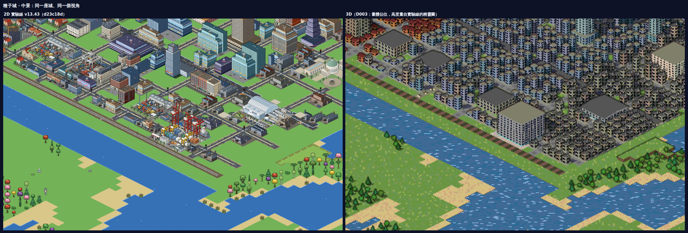
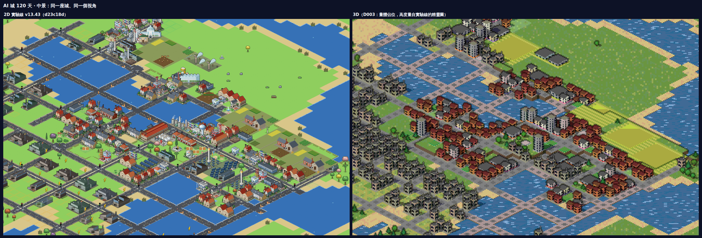

# 微光小鎮 3D 實驗線（GlimmerTown3D-lab）

**同一座城、三種時間。**

- **建造**：你親手蓋出一座城。
- **一生**：一個市民在這座城裡活完一輩子，城市在他身邊長大。
- **考古**：數百年後，城市已經荒廢；你走進廢墟，讀出它的歷史。

三種玩法共用同一個 3D 世界，和同一份「世界歷史」。

《微光小鎮 Glimmerville》的第三條線。另外兩條是 2D：主線 [GlimmerTown](https://github.com/lijiabao1998/GlimmerTown)，以及美術實驗線 [GlimmerTown-lab](https://github.com/lijiabao1998/GlimmerTown-lab)。

- 願景與里程碑：[`docs/D000-vision.md`](docs/D000-vision.md)
- 給 Claude 的常駐規則：[`CLAUDE.md`](CLAUDE.md)
- 每一輪做了什麼、沒做成什麼：[`LOG.md`](LOG.md)

## 目前狀態：D003 2D 實驗線的城市出現在 3D 裡

業主 2026-09-25 定案：只參考 2D 實驗線、全力做建造、原始碼零外部素材、本倉庫定位是 Pre（看 [`docs/D003-lab-city-import.md`](docs/D003-lab-city-import.md)）。

**線上版**：<https://lijiabao1998.github.io/GlimmerTown3D-lab/>。手機可以直接開，可旋轉、縮放，點建築看它是什麼、約建於第幾天。

- 預設打開實驗線樣張頁的**種子城**；可以切換到 **AI 城 120 天**，也可以**貼上自己在 2D 實驗線匯出的分享碼**。
- 3D 讀的是實驗線存檔裡的每一格和每一棟：地形、高地、水、道路、鐵路、分區、樹，以及 186 種建築的種類、等級、佔地。
- 建築目前是量體佔位，高度量自實驗線的精靈圖。逐種外形要等 D004。

同一座城、同一個視角，左邊是 2D 實驗線，右邊是 3D：





上一張 D002 的「同一座城 300 年」示範還在，按「⏳ 300 年示範」或開 `?mode=history` 進入：時間軸 0→300 年，點任何一格看它的歷史。

## 本機開發

```bash
npm install
npm run dev        # 開發伺服器 http://localhost:8301
npm run build      # 輸出單一 dist/index.html
npm run unit       # Node 端守衛：解碼對帳、RLE、壞碼、模擬層純度、零外部素材（不用瀏覽器）
npm run smoke      # 無頭 Chrome 煙霧測試（先 build）
npm run shoot      # 拍樣張到 scratch/shots/（--set=d003 拍 2D 城市模式）
npm run extract -- --lab=../GlimmerTown-lab   # 從 2D 實驗線重抽建築表與樣本碼（只讀實驗線）
```
