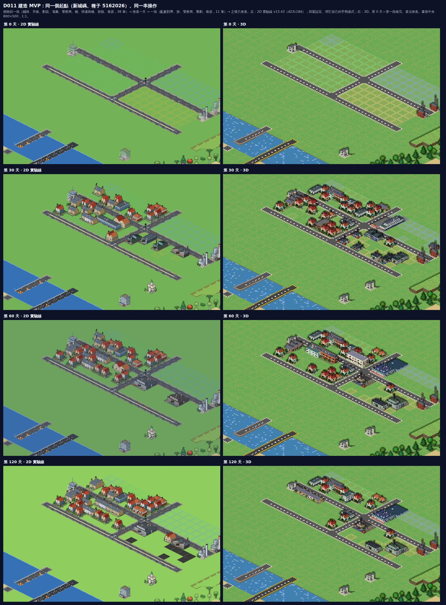
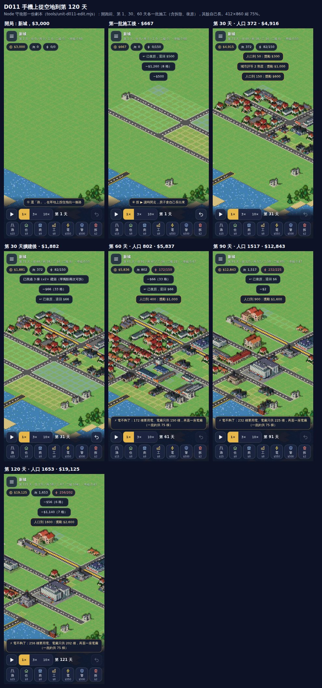
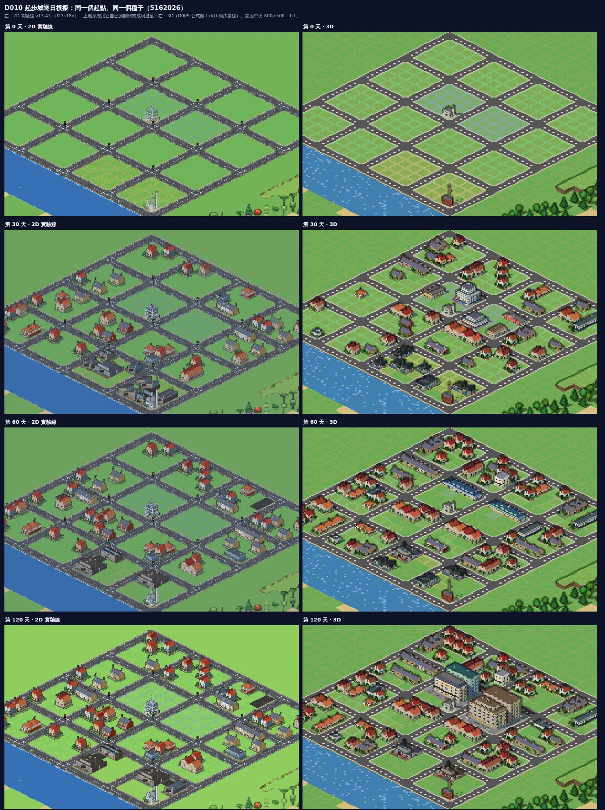

# 微光小鎮 3D 實驗線（GlimmerTown3D-lab）

**同一座城、三種時間。**

- **建造**：你親手蓋出一座城。
- **一生**：一個市民在這座城裡活完一輩子，城市在他身邊長大。
- **考古**：數百年後，城市已經荒廢；你走進廢墟，讀出它的歷史。

三種玩法共用同一個 3D 世界，和同一份「世界歷史」。

《微光小鎮 Glimmerville》的第三條線。另外兩條是 2D：主線 [GlimmerTown](https://github.com/lijiabao1998/GlimmerTown)，以及美術實驗線 [GlimmerTown-lab](https://github.com/lijiabao1998/GlimmerTown-lab)。

- 願景與里程碑：[`docs/D000-vision.md`](docs/D000-vision.md)
- 給 Claude 的常駐規則：[`CLAUDE.md`](CLAUDE.md)
- 每一輪做了什麼、沒做成什麼：[`LOG.md`](LOG.md)

## 目前狀態：D011 可以自己蓋了——鋪路、劃區、供電，看它長

業主 2026-09-25 定案：只參考 2D 實驗線、全力做建造、原始碼零外部素材、本倉庫定位是 Pre（看 [`docs/D003-lab-city-import.md`](docs/D003-lab-city-import.md)）。

**線上版**：<https://lijiabao1998.github.io/GlimmerTown3D-lab/>。手機可以直接開。

- 第一次打開是一座**新城**：種子城的地形、手上 $3000、第 1 天、暫停。
  - 選「路」（五級可選），一指按住拖出一條路，放開才蓋；拖的時候每一格會標出能不能蓋、總價多少。
  - 選「住／商／工」拖出一塊分區；「電」「警」點一下蓋電廠、警察局；「拆」一次拆一層；↩ 復原今天的施工，全額退錢。
  - 按 ▶，城市照實驗線的規則自己長，每天收稅、付維護費；人口到門檻有里程碑獎金，星等升級有獎金。
  - 關掉再開，城還在（存在瀏覽器裡，格式就是實驗線的分享碼）。☰ 選單可以匯出分享碼，貼進 2D 實驗線就能開。
- 兩指縮放、平移；沒選工具時一指轉鏡頭。點建築看它是什麼、哪一天蓋的、之後發生什麼事。

- ☰ 選單裡還有實驗線樣張頁的**種子城**、**AI 城 120 天**、全種類樣張，也可以**貼上自己在 2D 實驗線匯出的分享碼**（這些城只能看）。
- 3D 讀的是實驗線存檔裡的每一格和每一棟：地形、高地、水、道路、鐵路、分區、樹，以及 186 種建築的種類、等級、佔地。
- D004–D008 已做住商工街區配方、地面與明暗、183 種非住商工建築造型，以及英美立面的逐戶細節。預設 B 檔照 2D 實驗線切分街區；A、C 檔可切換比較。
- [D009](docs/D009-growth-formulas.md) 把生長、升級、幸福、地價、天氣與舊式供電等核心公式搬到純邏輯模組，與 2D 實驗線原始碼逐項對拍。
- [D010](docs/D010-starter-city.md) 把這些公式照實驗線 `tick()` 的順序接成逐日模擬：選單的**起步城**（路、住商工分區、一座電廠、一間警局）按 ▶ 就會自己長，每一棟長出來、每一次升級都記進世界歷史。
  - 跟實驗線從同一個起點各跑 8 個種子 × 120 天：第 1 天逐項相等，第 2 天起分岔。
  - 分岔是因為實驗線還有經濟、通勤、垃圾、糧食、疾病等系統，本線還沒搬；差多少、為什麼，列在卡上。
- [D011](docs/D011-build-mvp.md) 是第一個能玩的循環：玩家自己鋪路、劃區、蓋電廠和警察局、拆除、復原，每天結算。
  - 規則、數字、資料格式都照實驗線：放置規則與每日結算把實驗線原始碼放進 Node 跑，256 張隨機小圖 9,659 筆操作、2,700 組結算逐項相等；本線改一個數字、實驗線改一個數字都會被抓到。
  - 同一串操作在實驗線頁面上實跑（它自己的拉線、框選、復原函式）：8 個種子共 312 筆操作之後的資金、格子、各種場逐位相等；兩邊互相匯出的分享碼讀回來都一樣。
  - 第 2 天起兩邊還是會分岔，原因跟 D010 一樣：實驗線的經濟、垃圾、通勤等系統本線還沒搬。
  - 按鈕、手勢、畫面是本線自己設計的（業主：UI 可以更現代）。

同一串操作，第 0、30、60、120 天，左 2D 實驗線、右 3D（D011）：



手機上從空地到第 120 天：



起步城第 0、30、60、120 天，左 2D 實驗線、右 3D（D010）：



同一座城的 D008 立面對照：


上一張 D002 的「同一座城 300 年」示範還在，按「⏳ 300 年示範」或開 `?mode=history` 進入：時間軸 0→300 年，點任何一格看它的歷史。

## 本機開發

```bash
npm install
npm run dev        # 開發伺服器 http://localhost:8301
npm run build      # 輸出單一 dist/index.html
npm run unit       # Node 端守衛：解碼、內容對拍、D009 公式與供電實跑、D010 場對拍與逐日模擬、D011 建造與資金對拍、施工整合、實驗線實跑錨點、純度、零外部素材
npm run smoke      # 無頭 Chrome 煙霧測試（先 build）
npm run shoot      # 拍樣張到 scratch/shots/（--set=d003 拍 2D 城市模式）
npm run extract -- --lab=../GlimmerTown-lab   # 從 2D 實驗線重抽建築表與樣本碼（只讀實驗線）
node tools/lab-compare.mjs --lab=../GlimmerTown-lab   # D010：起步城兩邊各跑 8 種子 × 120 天，重錄對照樣本（要 Chrome）
node tools/lab-build.mjs --lab=../GlimmerTown-lab     # D011：建造規則黃金樣本（實驗線原碼在 Node 裡跑，不用 Chrome）
node tools/lab-money.mjs --lab=../GlimmerTown-lab     # D011：資金公式黃金樣本
node tools/d011-parity.mjs --lab=../GlimmerTown-lab   # D011：同一串操作兩邊各跑 8 種子 × 120 天，重錄實跑錨點（要 Chrome；--shots 拍 2D 樣張）
```
