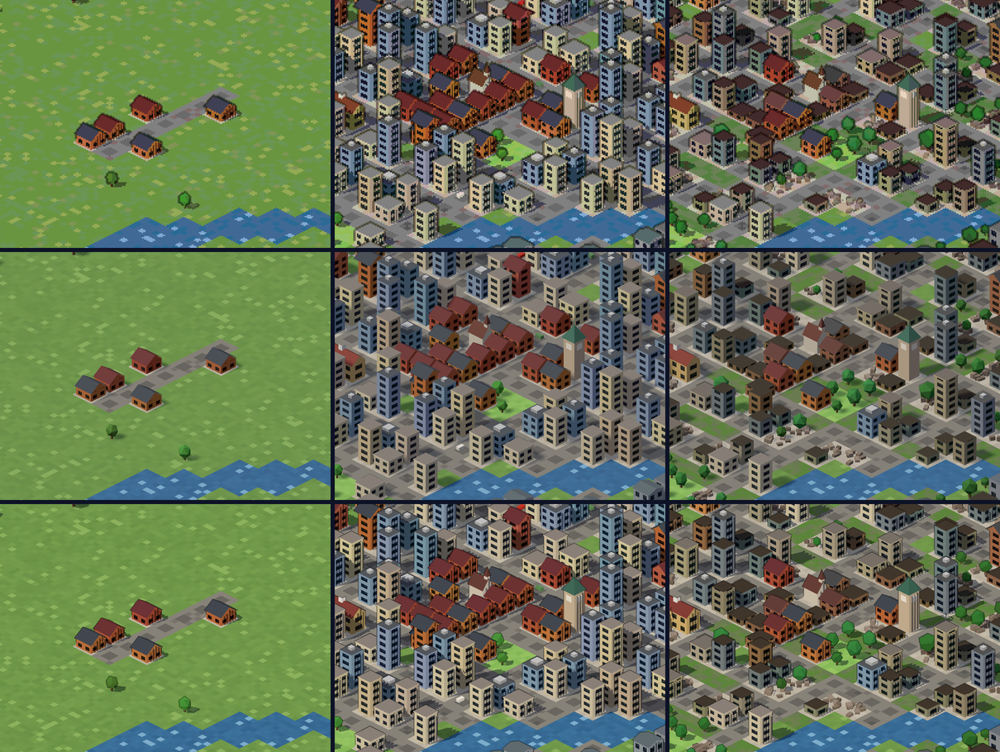

# 微光小鎮 3D 實驗線（GlimmerTown3D-lab）

**同一座城、三種時間。**

- **建造**：你親手蓋出一座城。
- **一生**：一個市民在這座城裡活完一輩子，城市在他身邊長大。
- **考古**：數百年後，城市已經荒廢；你走進廢墟，讀出它的歷史。

三種玩法共用同一個 3D 世界，和同一份「世界歷史」。

《微光小鎮 Glimmerville》的第三條線。另外兩條是 2D：主線 [GlimmerTown](https://github.com/lijiabao1998/GlimmerTown)，以及美術實驗線 [GlimmerTown-lab](https://github.com/lijiabao1998/GlimmerTown-lab)。

- 願景與里程碑：[`docs/D000-vision.md`](docs/D000-vision.md)
- 給 Claude 的常駐規則：[`CLAUDE.md`](CLAUDE.md)
- 每一輪做了什麼、沒做成什麼：[`LOG.md`](LOG.md)

## 目前狀態：D001 視覺承諾

同一座城的三個時間：第 0 年／第 80 年／第 300 年（左到右），三種候選畫風：A 像素風 3D／B 平滑低面數／C 卡通描邊（上到下）。



線上版（手機可旋轉縮放）：<https://lijiabao1998.github.io/GlimmerTown3D-lab/>

## 本機開發

```bash
npm install
npm run dev        # 開發伺服器 http://localhost:8301
npm run build      # 輸出單一 dist/index.html
npm run smoke      # 無頭 Chrome 煙霧測試（先 build）
npm run shoot      # 拍樣張到 scratch/D001/
```
