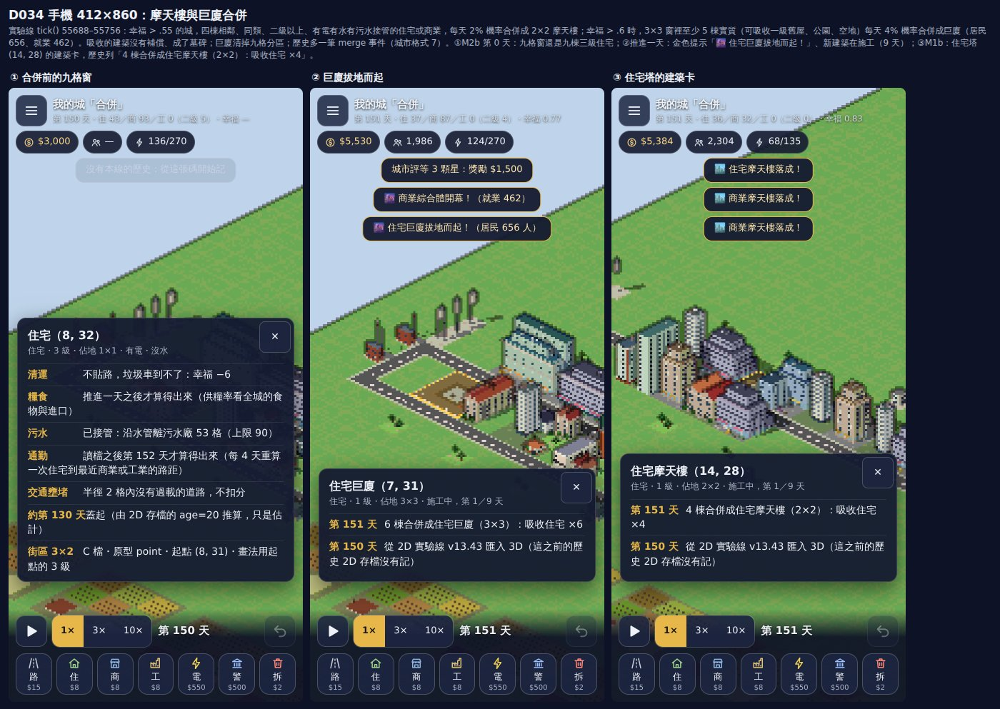

# 微光小鎮 3D 實驗線（GlimmerTown3D-lab）

**同一座城、三種時間。**

- **建造**：你親手蓋出一座城。
- **一生**：一個市民在這座城裡活完一輩子，城市在他身邊長大。
- **考古**：數百年後，城市已經荒廢；你走進廢墟，讀出它的歷史。

三種玩法共用同一個 3D 世界，和同一份「世界歷史」。

《微光小鎮 Glimmerville》的第三條線。另外兩條是 2D：主線 [GlimmerTown](https://github.com/lijiabao1998/GlimmerTown)，以及美術實驗線 [GlimmerTown-lab](https://github.com/lijiabao1998/GlimmerTown-lab)。

- 願景與里程碑：[`docs/D000-vision.md`](docs/D000-vision.md)
- 給 Claude 的常駐規則：[`CLAUDE.md`](CLAUDE.md)
- 每一輪做了什麼、沒做成什麼：[`LOG.md`](LOG.md)

## 目前狀態：D048 手機存檔警示與備份入口已發布

業主 2026-09-25 定案：只參考 2D 實驗線、全力做建造、原始碼零外部素材、本倉庫定位是 Pre（看 [`docs/D003-lab-city-import.md`](docs/D003-lab-city-import.md)）。

**線上版**：<https://lijiabao1998.github.io/GlimmerTown3D-lab/>。手機可以直接開。

- [D046](docs/D046-commission-reliability.md) 已在 `01eecbb` 合併並發布：可行委託、精確小數進度、常駐進度入口及世界歷史格式守衛。正式版完整 CI 515 個 Node／469 個瀏覽器檢查通過；另以正式網址複驗存讀與觸控。
- [D047](docs/D047-space-center-mobile.md) 已在 `64289885` 合併並發布：太空研究中心專屬建築／設備場、手機 UI 中斷取消、價籤避開 HUD／通知／工具列。業主核對九張真實圖片後批准上線；正式版完整 CI **529 個 Node／485 個瀏覽器檢查全過**。正式網址另驗 26 項、25 次文件 SHA256 全等，重拍九張圖逐位元組等於核准圖。Chrome 412×860 觸控模擬，Android 實機尚未測。沒有新系統或數值變更。
- [D048](docs/D048-mobile-save-status.md) 已在 `3e9dd2ad` 合併並發布：未存檔／歷史上限警示可觸控閱讀，接到既有本地分享碼匯出／返回流程，補焦點與中斷保護。八張圖片已確認；完整 main CI **539 Node／511 瀏覽器全過**，正式站另驗 **37 項**、16 次文件 hash 全等，五張新介面圖逐位元組等於核准圖。Chrome 360／412 觸控模擬，Android 實機未測；超長碼照舊可能不帶歷史，匯出不代表修復自動存檔。


- 第一次打開是一座**新城**：種子城的地形、手上 $3000、第 1 天、暫停。
  - 選「路」（五級可選），一指按住拖出一條路，放開才蓋；拖的時候每一格會標出能不能蓋、總價多少。
  - 選「住／商／工」拖出一塊分區；「電」點一下蓋電廠；「拆」一次拆一層；↩ 復原今天的施工，全額退錢。
  - 「公共設施」一組（D016）有十三種：公園、水塔、配水管、消防局、警察局、派出所、醫院、診所、學校、圖書館、郵局、墓園、垃圾場；點一下蓋（公園用框，配水管用拉線）。
  - 按 ▶，城市照實驗線的規則自己長，每天收稅、付維護費；人口到門檻有里程碑獎金，星等升級有獎金。
  - 關掉再開，城還在：目前的城存成實驗線的分享碼，世界歷史一筆一列存在瀏覽器的 IndexedDB（只增不改，D013）。☰ 選單可以匯出分享碼，貼進 2D 實驗線就能開。
- 兩指縮放、平移；沒選工具時一指轉鏡頭。點建築看它是什麼、哪一天蓋的、之後發生什麼事。

- ☰ 選單裡還有實驗線樣張頁的**種子城**、**AI 城 120 天**、全種類樣張，也可以**貼上自己在 2D 實驗線匯出的分享碼**（這些城只能看）。
- 3D 讀的是實驗線存檔裡的每一格和每一棟：地形、高地、水、道路、鐵路、分區、樹，以及 186 種建築的種類、等級、佔地。
- D004–D008 已做住商工街區配方、地面與明暗、183 種非住商工建築造型，以及英美立面的逐戶細節。D012 起預設 C 檔（超街區補滿），B 檔照 2D 實驗線切分街區，☰ 選單可以切換；A 檔（D004 的密度對照）D014 起拿出選單，`?blocks=a` 還開得到。
- [D009](docs/D009-growth-formulas.md) 把生長、升級、幸福、地價、天氣與舊式供電等核心公式搬到純邏輯模組，與 2D 實驗線原始碼逐項對拍。
- [D010](docs/D010-starter-city.md) 把這些公式照實驗線 `tick()` 的順序接成逐日模擬：選單的**起步城**（路、住商工分區、一座電廠、一間警局）按 ▶ 就會自己長，每一棟長出來、每一次升級都記進世界歷史。
  - 跟實驗線從同一個起點各跑 8 個種子 × 120 天：第 1 天逐項相等，第 2 天起分岔。
  - 分岔是因為實驗線還有經濟、通勤、垃圾、糧食、疾病等系統，本線還沒搬；差多少、為什麼，列在卡上。
- [D011](docs/D011-build-mvp.md) 是第一個能玩的循環：玩家自己鋪路、劃區、蓋電廠和警察局、拆除、復原，每天結算。
  - 規則、數字、資料格式都照實驗線：放置規則與每日結算把實驗線原始碼放進 Node 跑，256 張隨機小圖 9,659 筆操作、2,700 組結算逐項相等；本線改一個數字、實驗線改一個數字都會被抓到。
  - 同一串操作在實驗線頁面上實跑（它自己的拉線、框選、復原函式）：8 個種子共 312 筆操作之後的資金、格子、各種場逐位相等；兩邊互相匯出的分享碼讀回來都一樣。
  - 第 2 天起兩邊還是會分岔，原因跟 D010 一樣：實驗線的經濟、垃圾、通勤等系統本線還沒搬。
  - 按鈕、手勢、畫面是本線自己設計的（業主：UI 可以更現代）。

- [D014](docs/D014-construction-and-detail.md) 讓房子不再突然冒出來：照實驗線 T259 的 9 天工期。
  - 第 0 天開挖（圍籬、深坑、挖掘機、傾卸車），第 1 天打地基（鋼筋、攪拌車），第 2–3 天鋼骨框架長高、塔吊上場。
  - 第 4–8 天樓體一層一層長高，實驗線的露出比例 30／50／68／84／96%，外面搭鷹架、塔吊吊料到當下的樓板。
  - 1 倍速下每一幀都在長；塔吊、挖掘機、攪拌車、工人只在播放時動。住商工自然升級時照實驗線重蓋一次。
  - 近看有細節：牆面照屋齡風化（T591，14／120／240 天三級），拉近還有牆腳的花台、垃圾桶、冷氣機、工安斜紋、棧板、立管（T599）。
  - 地面改成只重畫變動的格。
- [D015](docs/D015-incremental-rebuild.md) 讓城市長大時的場景重建變輕：畫面一個像素都不變。
  - 每個街區、每棟建築的幾何照「件」快取，只重畫變了的（起步城每次重建約一成）。
  - 建築的頂點緩衝、地面貼圖常駐在 GPU，只上傳改到的那幾段：起步城一次重建從約 2.3 MB 降到約 190 KB。
  - 手機代理（CPU 降速 6 倍）下一次重建的主執行緒時間約少了六成；施工、拆除、復原之後的重建也一樣變輕。
- [D016](docs/D016-civic-tools.md) 是第二批建造工具：公共設施九種（公園、消防局、派出所、醫院、診所、學校、圖書館、郵局、墓園），加上原本的警察局，放在同一組按鈕裡。
  - 放置規則、造價、覆蓋半徑、每天的維護費與固定就業都照實驗線：實驗線原始碼在 Node 跑 164 張隨機小圖 6,297 筆操作，逐筆相等。
  - 同一串操作在實驗線頁面上實跑 8 個種子：每一筆、第 1 天的結算、旁邊住宅的幸福、兩邊互相匯出的分享碼，都一樣。
  - 這批設施目前透過覆蓋範圍影響幸福、地價與評分；火災、犯罪、疾病這些系統還沒搬，所以消防局還不會救火。
- [D017](docs/D017-noise.md) 把實驗線的噪音搬過來：機場、體育場、車站、焚化廠、物流中心、貨櫃碼頭等 19 種建築會吵到附近的住宅（幸福）和地價。
  - 本線自己還蓋不出噪音源，這一張主要修的是**讀進來的城**：從實驗線貼過來的分享碼、樣本城。
  - 噪音場跟實驗線原始碼逐格相等；實驗線頁面上留著體育場實跑 8 個種子，住在噪音裡的那一棟住宅幸福也逐位相等。
- [D018](docs/D018-park-art.md) 讓公園不再長得一樣：照實驗線公園精靈的九種設計畫——石徑長椅花、石徑、池塘、噴泉廣場、玫瑰園、遊樂場、涼亭、球場、野餐區。
  - 蓋公園時照實驗線抽一個變體；顏色逐色取實驗線原文，地坪改成實驗線的草地。
  - 公園以外的 182 種建築逐位不變（動手前錄了全種類的幾何雜湊表）；一座公園最多 182 個三角形。
- [D013](docs/D013-indexeddb-history.md) 把世界歷史從存檔裡搬到瀏覽器的 IndexedDB：一筆一列、只增不改。
  - 之前歷史跟著存檔塞在 localStorage，約 8 萬筆就存不下，而且每一筆手勢都要把整份歷史重寫一次。現在每一次只附加新的那幾列，9 萬筆跟 1 萬筆存一次一樣快。
  - localStorage 照舊放實驗線格式的目前狀態，貼進實驗線照樣能開；舊存檔照讀，存一次就搬進日誌；匯出的分享碼通常帶整份歷史；超過上限時，匯出視窗會明確告知改為只有城市、不帶本線歷史。
  - 瀏覽器不給用 IndexedDB 時，退回舊的存法，狀態列亮「⚠ 歷史有上限」。
- [D019](docs/D019-water.md) 是城市系統的第一張：供水。
  - 「公共設施」一組多了水塔（$400）和配水管（拉線，$10／格）。水塔旁邊接上水管，水管兩格內有電的住商工就有水；一座水塔供 80 棟。二級要有水才升得到三級。
  - 規則照實驗線的舊式供水網逐行搬：實驗線原始碼在 Node 跑 360 張隨機小圖逐格相等；實驗線頁面上 8 個種子拉水管、推進一天，每一棟有沒有水都一樣；讀進來的 AI 城 120 天也一樣（60／314 棟有水）。
  - 水管跟實驗線一樣平常埋在地下，拿著水塔或配水管才畫出來。建築卡講這一棟有沒有電、有沒有水。
  - 人口 500 以上二級升三級還要污水接管，污水還沒搬，所以大一點的城有水也還長不出三級；摩天樓合併也還沒搬。
- [D020](docs/D020-garbage.md) 是城市系統的第二張：垃圾。
  - 「公共設施」一組多了垃圾場（$300，處理 40）。沒有垃圾場、容量不夠、離垃圾場沿路超過 18 格，住宅都會不開心；人口 500 以上只算貼路的處理設施，路網分成清運區，各區自己的容量自己用。城市評分的垃圾那一項也照這個算。
  - 規則照實驗線的清運網與清運區原文搬：實驗線原始碼在 Node 跑 420 張隨機小圖逐格相等；實驗線頁面上 8 個種子蓋垃圾場、推進一天，每一棟住宅的幸福逐位相等（只差糧食那一項）；讀進來的 AI 城 120 天、種子城，把實驗線那一天的輸入代進本線的垃圾那一段，每一棟也逐位相等（種子城本線的人口少算了住宅塔、巨廈，自己推進會不同，列在卡上）。
  - 起步城跟實驗線的差距因此小了一截：第 120 天城市幸福本線 0.234、實驗線 0.236（D019 時本線 0.400）。（這個「幾乎相等」是巧合，D022 查清楚了：見下。）
  - 建築卡多一列「清運」：全城垃圾與容量、垃圾場沿路幾格、有沒有扣分。
- [D021](docs/D021-read-in-population.md) 補上讀進來的城的人口：
  - 住宅塔、巨廈的居民不看有沒有電，算進人口（種子城本線人口從 0 變成 1,400，跟實驗線一樣）；讀檔之後、第一天之前的人口也照實驗線算（種子城 5,436）。人口 500 以上才走正式清運、垃圾量看人口，所以這一筆會改變讀進來的城的垃圾數字。
  - 45 座城（預建城、AI 城、種子城、全種類樣張城、自己造的 34 座）讀檔後與推進一天後的人口，在實驗線頁面上逐座相等；把補丁拿掉六種不同的做法，守衛都會紅。
- [D022](docs/D022-food.md) 是城市系統的第三張：糧食。
  - 每天算食物量（農場、大農場、牧場、溫室、釣魚碼頭、社區菜園、魚塘；農場看季節）、遊客（觀光建築、地標、會展中心每 20 天一波）、貿易額度（路格、貿易站、港口、貨運、倉儲），居民每 10 人、遊客每 160 人要 1 單位糧食，本地不夠向貿易額度拿；供糧率 −.5 再乘 .11（夾在 −.06～.05）就是每棟住宅每天的幸福加減。起步城沒有農場、額度只有 3，所以人口一多，每棟住宅每天扣約 .045。
  - 規則照實驗線原文搬：實驗線原始碼在 Node 跑 700 張隨機小圖、每張三天，每個計數與數字逐位相等（實驗線原文改 26 處、本線改 38 處，全都轉紅）；實驗線頁面上 80 座城推進一天，判的 75 座、1,323 棟住宅，糧食那一段的每個輸入輸出與每一棟住宅的幸福全部相等；D011、D016、D017、D019、D020 的預建城對拍不再需要「套糧食」，直接相等。
  - 實驗線有、本線沒搬的輸入（物流、化肥、船、火車線、壅堵、城市活動、政策、污水廠）會讓讀進來的城不一樣：AI 城的政策「公園夜間開放」每棟 +.02、種子城進口 4／42，卡上都記了，只量不判。
  - 住宅的建築卡多一列「糧食」。
- [D023](docs/D023-service-budget.md) 補上讀檔還原服務預算：存檔的警察、消防、醫療、教育四類預算以前被忽略（一律當 1），調過預算的存檔讀進來，診所、醫院、警局的覆蓋範圍與每天的維護費都不對；現在照實驗線讀進來（夾 .5–1.5、不是數字的不理），13 座城在實驗線頁面上的預算與 60 個覆蓋場逐場相等。
  - 起步城第 121 天的幸福 0.234 → 0.192 不是變差：D020 那時的 0.234 剛好是「沒糧食的扣分」抵掉「本線 6 成住宅沒電」的巧合。糧食單日算式跟實驗線逐位相等，前 60 天的差縮小（46–60 天 .032 → .004）；後段拉開的來源是本線的城長到 146 棟（實驗線 54 棟）、超過發電廠容量，那由需求決定，等經濟快照與通勤。
- [D024](docs/D024-counting.md) 補齊主計數迴圈：實驗線每天對每棟建築數 157 個計數，本線之前只數了 46 個，讀進來的城的固定就業與維護費因此差很多（種子城實驗線 1,407 個職位、本線 0；全種類樣張城 2,997 對 43）。
  - 補上剩下的 111 個計數（升級加成就業、電廠以外的發電、產業鏈、物流十種的「建成」與「運作中」、旅宿與配套、地標、科技園區、公共設施……），固定就業與維護費跟著接上；電力設施、水務設施、基建（加手工配電線、地下線、高架、立交四種格子旗標）、車庫四組「掃整張圖」的就業與維護費函式一併搬。
  - 讀檔也把辦公區（商業就業 ×1.5）、鐵路格、手工配電線、地下線、高架、立交這幾層帶進格子。本線的拆除照舊看不見鐵路、配電線、地下線（歷史事件還沒有它們的拆除碼）；拆路、拆分區照實驗線帶走高架、立交、辦公區的旗標，存檔寫回。
  - 對拍：實驗線原文在 Node 跑 1,400 張隨機小圖，155 個計數逐項相等；103 座城在實驗線頁面讀檔、推進一天，計數、名目就業、維護費逐座相等；改壞實驗線原文 52 處、本線 46 處、day.ts 9 處、拆除與存檔 4 處，全部轉紅。起步城 8 種子 × 120 天的軌跡逐位元組不變（這張只改讀進來的城）。
- [D025](docs/D025-economy.md) 接上經濟：實驗線每天算一份「經濟快照」（購買力、零售利用率、貨物缺貨、出口訊號、工業市場乘數），**隔天**的商業與工業需求讀它；本線以前沒搬，商工需求走舊式，起步城商業需求恆 +1、蓋出 31 間商店，實驗線的商業需求是 −0.78、幾乎不長。
  - 搬了：共享貿易額度（糧食排第一個拿，之後天然氣、燃料、鋼材、供應品、貨物進口，再糧食、天然氣、貨物出口，燃料與鋼材出口在最後）、六種商品庫存、零售與購買力與價格、四個稅乘數、六種進口費、各項出口金、船與造船、太空研究中心、煉鋼廠加速施工、資源回收廠產貨物；庫存進存檔（`sup`、`gds`、`fuel364`、`steel364`、`shipCount`、`shipProgress`，實驗線格式）。商業與工業的建築卡多一列「市場」。
  - 效果（起步城 8 種子第 121 列，本線 D025 之前｜之後｜實驗線）：商業需求 +1.000｜−0.780｜−0.777、工業需求 +1.000｜−0.235｜−0.235、住宅 145.8｜55.9｜54.0 棟、商業 31.0｜0.1｜0.1 棟、人口 413.0｜360.5｜359.6。**沒有變近的**：幸福度 .192｜.307｜.236（差距 .044 擴大成 .071）、工業棟數 31.0｜30.9｜22.1；我推測是實驗線的火災、犯罪、疾病、壅堵本線沒搬，但沒有逐項量過。
  - 對拍：實驗線原文在 Node 跑 1,040 張隨機小圖、每張連三天共 3,120 步，每個中間量逐位相等；120 座城在實驗線頁面讀檔、推進一天全等（其中 103 座連收入都判，17 座收入只量不判、原因都記了）；起步城 8 種子 × 120 天與另外 8 座城 × 30 天共 1,200 個城日全等；改壞實驗線原文 127 處、本線 137 處全部轉紅。
  - 沒搬的（照實講）：道路負載與壅堵、火車線、開採量、企業層、政策、商業循環、夜間城市、城市活動（回退設定下照樣每 37 天一場，守衛把實驗線那天的值代進去）、火災與犯罪與疾病、大型購物中心稅、化肥與熟食與其餘收入加成（D026）。
- [D026](docs/D026-hazards.md) 接上每天的災禍：火災、犯罪與廢棄、疾病與死亡。實驗線每天對每一棟建築抽亂數決定誰起火、誰犯罪、誰生病，本線以前完全沒有，起步城的工業與住宅因此比實驗線多、城的種子之間也沒有隨機差異。
  - 搬了：起火（消防局、瞭望塔、韌性設施、科技與專精的乘數）、蔓延、燃燒 5 天燒成焦土；犯罪（警察局、派出所、監獄、法院的覆蓋）與犯罪滿 15 天後每天 5% 廢棄（停稅）；疾病（醫院與診所的覆蓋、昨天結算的床位）與病滿 3 天每天 10% 死亡、死亡 10 天後恢復、沒有墓園安撫的鄰居幸福 −.1。三段共用同一條亂數流。
  - 玩家能做的：建築卡上多了 [🧯 滅火 $30]、[✅ 處理犯罪]、[💊 治療 $50]，焦土用拆除清掉；每天每一類第一件事跳提示（點一下鏡頭過去）。畫面：帶旗標的建築頭上一顆寶石（橘＝火、黃＝犯罪、紅＝病、灰＝死亡、褐＝廢棄）、焦土是炭黑地面；手機 draw call 8。
  - 世界歷史多了 `fire`、`burn`、`crime`、`abandon`、`sick`、`death`、`act` 與拆除焦土；城市格式 5 → 6（沒有災禍事件的存檔照舊寫 4／5）；存檔的七個旗標層照實驗線寫，實驗線讀得進來。
  - 對拍：實驗線原文在 Node 跑 800 張隨機小圖 × 3 天 = 2,400 步，每一棟每個旗標與亂數位置逐位相等（改壞實驗線原文 75 處、本線 64 處全紅）；162 份存檔（18 座自造城 5–6 天、120 座 D022–D025 的城、24 份實驗線自己長出來的存檔）在實驗線頁面連推共 259 個城日，旗標、焦土、床位、下一個亂數逐項相等。
  - 效果（起步城 8 種子第 121 列，實驗線｜本線 D026 之前｜之後）：工業棟數 22.1｜30.9｜19.5、住宅 54.0｜55.9｜54.0、人口 359.6｜360.5｜359.6、就業 99.5｜108.3｜92.5；種子之間的散布從幾乎 0 變成跟實驗線同量級。**幸福度沒有縮**（0.236｜0.307｜0.320，t = 5.75）：還缺通勤與壅堵、夜間城市、政策等項，D027 起搬。起步城整城逐日相等只到第 11–23 天，之後只比統計。
  - 沒搬的（照實講）：消防車、警車、救護車；火與煙的動畫；政策、夜間治安、科技與專精（守衛注入才對拍）；災害那一組（洪水、龍捲風、隕石、暴亂、瘟疫、乾旱、暴風雪、工業洩漏）；保險理賠；沒上實機。
- [D027](docs/D027-traffic.md) 接上通勤與壅堵：每個住宅到最近商業或工業的路距（超過 20 格每格扣 1.2 點幸福、封頂 18、到不了扣 30）、每條路每天的車流與容量、過載的路讓半徑 2 格內的住宅每格 −3 幸福（上限 −15）、地價每格 −12（上限 −50）、物流效率跟著降。D026 收工時起步城幸福比實驗線高 .084（t＝5.75），我事前在實驗線頁面上逐項量出這兩項合計 −.10，搬完就是它。
  - 搬了：通勤叢集（每 4 天重算、每 6×6 格取第一棟住宅當代表、沿路走到最近的就業區）、道路負載（昨天 ×.85＋今天 ×.15）、動態地價、住宅幸福的「交通壅堵」與「通勤」兩項、經濟的物流效率讀道路負載、`DayReport.happyAgg`（城市平均每一項幸福）。不存檔、不進歷史、城市格式不動。
  - 畫面：過載的道路格在地面貼圖上疊暖色（黃到紅，7 檔，不佔 draw call，每天就地更新）；路格卡多「交通：負載／容量（比例）——過載」；住宅卡多「通勤」（不可達／太遠／不扣）與「交通壅堵」；☰ 多「幸福構成」（全城平均每一項，最負的標紅並附建議）。
  - 頁面實跑逐日逐欄比對（實驗線的探針只讀）：自造城 17 座、D022–D025 的 120 座城（分區清成 0 與不清各一批，1,200 個城日）、起步城存檔 24 份、起步城 8 種子 × 120 天代入實驗線的夜間城市與城市活動與政策——**除了 3 座只差幸福的城，全部每一欄每一天逐位元全等**（960 個城日的起步城軌跡也是）；實驗線原文在 Node 跑 320 張隨機小圖 4,480 步逐位相等，改壞實驗線原文 50 處、本線 47 處、`day.ts` 22 處全紅。
  - 順便補了兩件被逐日比對逮到的舊缺口：社宅（k127）讀檔時的財富級（實驗線固定 0）、電視訊號（T330，前一天有電視台就 +.015）。
  - 效果（起步城 8 種子第 121 列，實驗線｜本線 D027 之前｜之後）：**幸福度 0.236｜0.320｜0.238（t 5.75 → 0.23）**、人口 359.6｜359.6｜364.0、就業 99.5｜92.5｜96.0、工業棟數 22.1｜19.5｜20.8；全程平均差幸福 .067 → .006、人口 4.8 → 1.2、就業 4.3 → 1.1。玩家實際玩到的本線，道路負載、人口、就業、亂數位置 6／8 個種子 120 天全程逐位相等（D026 收工時只到第 11–23 天）。
  - 沒搬的（照實講）：畫面裡的小車（實際玩起來的實驗線負載比本線高）、T491 行動力、T468 公交可達性、夜間城市（起步城剩下的幸福差 −.0025）、城市活動、政策、城市等級 T133、熟食 T346、污水管網 T442（3 座城因此只差幸福）；沒上實機。

- [D028](docs/D028-economy2.md) 接上經濟的第二半：天然氣供需帶動的**化肥與熟食**（T346）、農牧與旅宿等**十一種其餘收入**、**大型購物中心的稅**。D025 做經濟時把「稅以外的收入」與購物中心稅留著沒搬，起步城看不出來，玩家蓋了農場、旅宿、科技園之後錢就對不上實驗線。
  - 搬了：化肥廠有天然氣就產化肥（化肥廠數 × 6 × 供氣率），**隔天**覆蓋（半徑 10 格）內的農場與大農場食物與金幣 ×1.35；中央廚房把用掉的食物煮成熟食（× 供氣率），隔天覆蓋內的住宅幸福 +3%、每份收 $0.6；農場、牧場、溫室、食品加工、旅宿、農貿市場、釀酒、科技園、數據中心、銀行利息十一項收入；k65 大型購物中心的稅（等級、路面、公車、郵局、停車、遊客）；工資指數（只是顯示）。化肥與熟食的旗標是「昨天的天然氣」，不存檔、不進歷史，讀檔後第 1 天沒有增產（跟實驗線一樣）。
  - 畫面：☰ 多「收支明細」（住商工稅、非零的收入項、收入合計、維護費與其中的進口費、淨額、工資指數）；農場與大農場的卡多「化肥」（在不在覆蓋內、最近一天有沒有產出、下一天 ×1.35 或 ×1）；天然氣井、化肥廠、中央廚房的卡多「天然氣」（全城供需與供氣率、產出）。
  - 對拍：實驗線原文在 Node 跑 5,600 組其餘收入、700 座城的化肥、900 組購物中心稅全等（改壞實驗線原文 39 處、本線 56 處全紅）；頁面實跑自造城 16 座 × 13 天（208 個城日）與 D022–D025 的 120 座城 × 10 天 × 兩批（各 1,200 個城日）：資金（不取整）、稅、十二個收入項、鏈條九欄、食物、遊客、旅宿、每一棟住宅的幸福、幸福構成 57 項、人口、就業、亂數位置**逐位元全等**，只有 seed516、D3 兩座只差幸福（D027 收工時的 G14 消失了）；`day.ts` 改壞 41 處全紅。
  - 沒有動起步城：起步城 8 種子 × 120 天、`newcity`、預建城的 `simHash` 與整份報表逐位元組不變（沒有這些建築）；黃金樣本沒有重錄（只有 D011 的 3D 樣本因報表多了 `other`、`imports` 兩組欄位重錄，32 處）。
  - 效果：120 座舊城第 1 天淨收入跟實驗線有差的城 28 座（合計 $3,253，最大 $542）→ 0 座（ai120 開著政策例外）；自造城 13 天加總 16／16 座有差（最大 $12,830，購物中心）→ 0／16 座。
  - 沒搬的（照實講）：地鐵、地面運輸、夜間運輸與停車的收入（照舊是輸入）、政策對這幾項的影響（K）、城市活動的收入乘數（D）、夜間城市的晚間消費金與每日幸福加減（J：玩家實際玩到的本線因此只差這兩處）、天然氣發電的需求、企業層、資源開採；沒上實機。

- [D029](docs/D029-night-city.md) 接上**夜間城市**（T487，backlog J）：每天結束前算一次城市的「安全與活力」，**隔天**的住宅幸福多一項「夜間城市」（每棟每天 −.003 上下）、犯罪抽籤讀它的乘數；**當天**的晚間消費金（同時算進商業稅）、夜間運輸收入與夜間營運費進收支。D028 收工時「玩家實際玩到的本線」跟實驗線只剩兩處不同，來源都是它。
  - 搬了：輸入（道路格與路級權重、公車站與鐵路、住商工與民生與娛樂設施與公園的面積）在生長之前算；結算在災禍之後、收稅之前（安全分數＝.18＋警察覆蓋 ×.31＋運輸服務 ×.10−失業 ×.06……、晚間商業活動、晚間消費金、夜間運輸收入、營運費、對住宅幸福的每日加減）；隔天讀的（幸福項、犯罪乘數）與當天讀的（收支）分開；狀態是執行期的、不存檔，讀檔與新圖的第 1 天沒有、第 2 天起才有（跟實驗線一樣）。
  - 畫面：☰ 多「夜間城市」（11 列：安全與等級、路燈覆蓋、警察覆蓋、運輸服務、晚間商業活動、乘客、晚間消費金、夜間運輸收入、夜間營運費、夜間淨額、對住宅幸福的每日加減）；「收支明細」多夜間運輸、其中夜間營運、其中晚間消費金；「幸福構成」多「夜間城市」一項。
  - 對拍：實驗線原文在 Node 跑 3,200 組隨機輸入逐位相等（改壞實驗線原文 174 處、本線 175 處全紅）；頁面實跑**不代入夜間城市的任何東西**：自造城 K1–K16（208 個城日）與 D022–D025 的 120 座城 × 10 天 × 兩批（各 1,200 個城日）夜間城市六欄逐位元全等，D028 的全部欄位也是（只有 seed516、D3 兩座只差幸福，照舊）；起步城 8 種子 × 120 天代入城市活動與政策 960 個城日全等；`day.ts` 改壞 24 處全紅。
  - 效果（起步城 8 種子第 121 列，實驗線｜D029 之前｜之後）：幸福度 0.236｜0.238｜0.236（t 0.23 → 0.04）。玩家實際玩到的本線在實驗線的第一場城市活動（第 36 天）之前**整條軌跡逐位元全等**；活動日以外 6 個種子 104 天每一欄全等。**逐日全等到第 120 天的種子還是 6／8，沒有變成 8／8**：另外兩個種子在第一場城市活動之後走上不同的路，來源是還沒搬的城市活動（T299），不是夜間城市。
  - 沒搬的（照實講）：公交乘客 T463／T468（夜間運量只有站點那一半，量不到差）、T471 電力調度的公共照明（路燈覆蓋固定 0）、政策（夜市、公園夜間開放、宵禁、免費公交的公式逐項對拍過，遊戲裡沒有政策）、實驗線完整的夜間營運報告、城市活動 T299（起步城與實驗線剩下的全部差異，下一張建議）；沒上實機。

手機上的夜間城市（D029）：①起步城第 40 天 ☰「夜間城市」；②同一份數字在「幸福構成」裡多了一項；③沒有警察局的城（安全等級 D，附建議）；④公車站與鐵路的城的「收支明細」（夜間運輸、其中夜間營運、其中晚間消費金）：


起步城 8 種子 × 120 天的整城軌跡離實驗線多近（實驗線｜D029 之前｜D029 之後；玩家實際玩到的本線，不代入任何輸入）：


- [D030](docs/D030-city-events.md) 接上**城市活動**（T299，backlog D）：每 37 天（人口 > 50、第 15 天之後）決定性觸發一場臨時活動，持續 3–10 天，加成**當天**的住宅幸福、食物點數與整筆收入（收入乘稅率再取整）。事件只由日子決定：同一天所有城是同一場，起步城 8 個種子的三場（第 37、74、111 天）完全一樣。
  - 搬了：61 種事件（名稱與說明照實驗線，含簡體字的那一批）、觸發與倒數（觸發那天算第 1 天、結束那天不觸發新的、沒有亂數）、三個加成、存檔的 `cev`（實驗線既有的可選欄位：有活動寫 `{i, d}`、沒活動範本有就寫 0、沒有就不加；缺與壞的讀成沒有）；活動不進世界歷史、城市格式不動。
  - 畫面：活動開始跳金色提示「✨ 名稱！說明」、結束跳「🎏 活動結束：名稱」；☰「收支明細」活動中多一列「✨ 名稱（剩 D 天）　稅×　食×　幸福±％」；「幸福構成」活動中多「城市活動」一項。
  - 對拍：實驗線原文在 Node 跑 71,293 步逐位相等（表 61 條逐欄、單步隨機 24,000 組、367 條逐日連推、讀檔 163 種形狀；改壞實驗線原文與本線各 459＋466 處全紅）；頁面實跑**不代入活動的任何東西**：起步城 8 種子 × 120 天（玩家實際玩到的本線）**960 個城日每一欄逐位元全等**、長出來的存檔 24 份（8 份讀進來就在活動中）、自造城 J1–J17 與 K1–K16、D022–D025 的 120 座城兩批（seed516、D3 只差幸福，照舊）；`day.ts` 改壞 21 處全紅。
  - 效果：**玩家實際玩到的起步城，8 個種子 × 120 天，跟實驗線每個數字、每一天逐位元相同**（第 0 列的 `jobs` 除外，D010 起就有）——D029 是 6／8；幸福度第 121 列 t 0.04 → 0.00。
  - 沒搬的（照實講）：收割視覺聯動、公民代理的社交需求、實驗線的活動面板與音效（畫面與代理）；活動沒記進歷史（等業主定）；實驗線頁面實跑只碰到 61 種事件裡的 5 種，其餘 56 種只有 vm 對拍；讀檔擋非整數的 `cev.i`（實驗線不擋、下一天會丟例外，是唯一的差）；沒上實機。

手機上的城市活動（D030）：①起步城第 37 天活動開始的金色提示；②活動中的「收支明細」多一列；③活動中的「幸福構成」多一項：


起步城 8 種子 × 120 天的整城軌跡離實驗線多近（實驗線｜D030 之前｜D030 之後；玩家實際玩到的本線，不代入任何輸入）：


- [D035](docs/D035-load-layers.md) 補齊**讀檔的格子圖層**（L）：2D 存檔的**公車站、路旁裝飾、輕軌、公車專用道、單行道、紅綠燈、裝飾、高壓線、地下高壓線、水幹管、污水幹管**十一層以前原樣躺在存檔裡、模擬的格子上沒有，現在進了格子——模擬早就會讀它們：**公車站與路旁裝飾**進覆蓋場（覆蓋內住宅幸福 +.04／+.03、商業稅 ×1.1、夜間城市的轉運節點）、**高壓線**讓「發電廠不在路網上、高壓線接到開關站」的遠端住宅區有電（變電所接力）、**污水幹管**把兩段管網連成一個、走幹管的距離成本 0（0–1 BFS）。
  - 本線的施工也會讓存檔跟著對：拆有公車站的路格**一下拆到路**（本線看不到站牌，所以拆路時自己撤掉公車站、路旁裝飾的覆蓋印、輕軌一併拆，結果＝實驗線一層一層拆到路）；蓋路、劃區、蓋建築清掉裝飾；存檔只把「格子上沒了而範本不是 0」的格寫成 0，沒動過的存檔位元組不變；看不見的層（高壓線、幹管……）點「拆除」拆不到。建築地面格的卡片講得出這幾層。
  - 守衛：實驗線頁面實跑 L 系列 8 座自造城（公車站與路旁裝飾、輕軌、高壓線接力〔連得上／斷一格／地下〕、污水幹管橋接〔橋得上／差一格〕、全混）**104 個城日每一欄全等，錢也判**；「沒讀這些層」的那一版對每座有效果的城都跟實驗線不同；160 個污水幹管佈局逐棟全等（拿掉幹管有 38 個佈局不同）；本線拆路蓋東西之後存的碼，實驗線讀得回去、再推 3 天全等。
  - 沒做的（照實講）：高程、鐵路橋、碼頭、路邊停車、洪水、堤防、隕石坑沒進格子（模擬沒有讀者）；十一層都不畫、玩家蓋不出新的（只有讀進來的存檔有）；**公車路線與票務沒搬**（只有站牌進來了；有路線的存檔會多出一點車資、營運費與夜間分數的差，D037 量化）。
- [D036](docs/D036-resource.md) 補齊**資源開採**（M）：**油井 k49 站在油田格上每天抽 3、礦場 k50 站在礦藏格上每天抽 2**，累計進該格的耗損（到 240 就耗盡）；抽出來的量進供應品，煉油廠把油煉成燃料、鋼鐵廠把礦煉成鋼材——**經濟那幾行本線早就搬了，只是 D024 起「開採量」一律 0**，所以有井的城供應品、燃料、鋼材一直不動。資源圖由存檔種子決定（兩張值噪聲、門檻 .74），讀檔重建、不入存檔；**耗損入存檔**（稀疏可選欄位 `rdep`，實驗線照樣讀得到；沒挖過的存檔位元組不變）。點油井、礦場的建築卡多一列「開採」（站對資源格嗎、已開採 x／240、每天抽多少、已耗盡）。
  - **玩家目前蓋不出新的井**（沒有 `oilwell`／`mine` 工具、也沒有資源圖視圖）：只有讀進來的 2D 存檔裡本來就有井的城才會抽；要不要做是業主的決定（見卡）。
  - 守衛：實驗線原文（17 段 sha256）在 vm 跟本線吃 400 個種子的資源圖與 21 萬口井日全等（突變 56 個全紅）；實驗線頁面實跑 W 系列 5 座（含耗盡、分流、壞的 `rdep`）**112 個城日每一欄全等，錢也判**，60 個種子的資源圖 28,530 格逐格全等；本線存的碼給實驗線讀、再推 3 天全等。
- [D037](docs/D037-bus.md) **量**公車路線（T463／T468：`bus_rt` 路線、`bop468` 營運設定）本線沒搬的缺口，**不搬**：同一座城、六個站牌，只在存檔欄位上不一樣——T1 一條路線、T2 兩條路線＋較大的車隊、T3 沒有路線（對照）。**T3 13 個城日逐位全等；T1／T2 的差只在夜間城市、幸福、資金、稅這八個欄位，帶入實驗線的票收與營運費之後殘差每天不到 $0.003、幸福不到 0.0004**；玩家實際會碰到的缺口是：本線不看路線，所以票收（每天 +$1）、營運費（每天 −$1.1／−$6.37）都是 0，有路線的 2D 存檔資金每天差 $0.1（一條）到 $5.4（兩條加大車隊）。守衛把這個缺口鎖住（本線完全不看路線；有路線的存檔讀進來、推幾天、再存，`bus_rt`、`bop468` 原樣帶回）。**建議先不搬**，理由與要業主定的事在卡上。這張不改 `src/`。
- [D038](docs/D038-tech.md) 補齊**科技與專精**（T343／T386）：科技的**效果**本線早就搬了（各處收 `tech`／`spec` 參數），但**狀態永遠是空的**——存檔裡的 `tech343`、`spec386` 讀檔就丟、每天的研究沒人推、玩家沒辦法開始研究或選方向。現在 ☰ 選單多了**「科技與專精」**面板：研究進度條與還要幾天、四條路線（產業線、民生線、文教線、遠望線）各 9 個節點，每個節點講效果、費用、研究點數與狀態（做完／研究中／可開始／鎖住的原因：前置沒做、二選一、要先完成 30 個）；按「開始」扣款（已有進度的免費、換著做不丟進度）；**城市方向**四選一（工業港城、綠色城市、教育科技城、交通樞紐；Lv.9、永久、第一下標起來第二下才定）。每天在主計數迴圈之後推進研究（速度＝1＋研究院等建築〔上限 7〕＋C6／D2／D5＋教育科技城），完成教育場科技就重建覆蓋場；觀光（綠色城市 ×1.15）與造船港金（工業港城 ×1.25）的專精接上；存檔 `tech343`、`spec386`，實驗線照樣讀得到。
  - **住宅幸福讀的是研究前的清單**（實驗線同一個大迴圈裡、早了 26 行）：當天完成的科技，幸福隔天才吃到，稅、生長、需求當天就吃到；這個順序只有頁面實跑看得出來。
  - 守衛：實驗線原文 22 段在 vm 跟本線逐項全等（300 個隨機狀態 × 36 節點、研究完成 3,892 次、400 個亂寫的存檔欄位；突變 91 個全紅）；實驗線頁面實跑 T 系列 18 座（四條路線、研究到完成、做完 31 個之後的 D8、四個方向、畸形欄位與白名單怪癖）**234 個城日每一欄全等，錢也判**；P 系列 6 個劇本 27 個動作（開始研究與選方向的各種擋下與成功）逐項全等；本線存的碼給實驗線讀、再推 3 天全等（6 筆）。
  - **沒搬的**：軌道運量的科技倍率（A2、C5、交通樞紐，屬公車與軌道）、委託的「科技」目標、AI 市長自動研究、科技樹連線圖；玩家的研究與選方向**不進世界歷史**（跟政策一樣，要業主定）。
- [D039](docs/D039-decisions.md) 把**玩家的決策記進世界歷史**（城市格式 8）：調稅率、開關政策、動服務預算、開始研究、選城市方向、研究完成，各成一種新事件（`policy`、`budget`、`research`、`spec`、`techdone`，緊湊列碼 18–22；政策與預算帶著「改之前的值」，歷史自己讀得出「從多少調到多少」）。☰ 選單多一項**「大事記」**：決策與科技完成，新到舊，一行一筆（「住宅稅：1.0× → 1.1×」「開始研究：標準化生產（−$400）」「學會了：標準化生產」「城市方向：🎓 教育科技城」）。真的改了才記（冷卻中、同值、被擋的動作都不記）；**沒有決策的城存檔位元組不變**，舊檔照讀、比 8 新的不猜。歷史是紀錄、不是第二個真相來源：模擬仍從存檔欄位讀。
  - 守衛：200 段隨機動作劇本（1,199 筆決策事件、被擋的動作 1,115 個）結束時，從歷史折出來的政策、預算、完成清單、進行中的節點、方向**逐項＝模擬**；編解碼、日誌接續編碼、只增不改、壞資料與突變；本線存的碼（現在是格式 8）給實驗線讀，**讀回來的列逐位元不變**（D032 4 筆、D038 6 筆重錄）。
  - **沒記的**：模擬自己的大事（升等、里程碑、星等、城市活動）；2D 存檔讀進來時已有的政策與科技（匯入是起點）。要不要記，卡上有建議。
- [D045](docs/D045-commissions.md) 把實驗線的**市長委託（T385）**搬進來（D043 量過缺口之後業主授權）：☰ 多一項「委託」——11 條委託（造船用鋼、糧食出口、公共運量、幸福連續天數、研究學術網絡、外貿合約庫存驗收，獎金 $1,000–3,200）、**決定性三選一**（世界種子＋輪次的雜湊，零亂數）、接受／放棄（放棄＝換一批、沒有懲罰）、進行中的進度條與剩餘天數；每天在收支、晉升之後純讀已算好的值結算，**完成才一次性加獎金、過期不罰款、沙盒不出委託**。存檔欄位 `cms385` 用實驗線的格式（零狀態不落欄位），2D 存檔裡進行中的委託讀得進來、本線的碼實驗線讀得回；世界歷史多一種 `cms` 事件（接受、放棄、完成、過期；城市格式 10、緊湊列碼 24），大事記多一種、通知的字與顏色＝實驗線。公共運量本線沒有（公車與票務沒搬）：兩條運量委託照常出現、面板標明做不到。
  - 對拍：實驗線 14 段原文在 vm 裡逐項＝本線（雜湊 20,000 組、三選一 6,000 個狀態、讀存 1,500 組、接單放棄 4,000 組、每天結算 500 段 × 40 天；實驗線原碼突變 46、本線 47 個全紅）；**實驗線頁面實跑 13 個劇本與 D043 的起步城 8 座（36 段、7,236 列）逐列全等**（含完成 +$1,800／+$3,200／+$3,000、過期、期末驗收、沙盒）；未接單＝零模擬副作用（60 天每天逐欄相同）。
  - 查到的實驗線怪癖（本線照抄、守衛釘住）：三選一的雜湊用浮點乘法（種子大時低位被吃掉）；存檔欄位只收整數，**造船用鋼的累計帶小數、存檔再讀回來整欄棄用**。
  - 沒做成的（照實講）：運量委託永遠做不到（標明可放棄）；沒有完成的音效與彩帶、沒有常駐的進行中提示；糧食出口型的頁面實跑沒有城真的完成過；沒上實機。新編號（事件碼 24、格式 10）請業主定。
- [D044](docs/D044-industry-tools.md) 補上實驗線 resource 類的另外兩支工具（D040 沒做的）：**天然氣井**（k117，$1,400，1×1、站在油田格上、是污染源）與**太空研究中心**（k51，$4,500，**3×3**，工具列要城市 Lv.22 才解鎖，之後每 24 天一輪花 180 供應品、一座換 $3,500）。「公共設施」18 顆三排（按鈕上只放兩個字「氣井」「太空」，完整名字給讀屏）；拿著天然氣井畫油田；拿著太空研究中心按住一格預覽整塊 3×3（九格同一個 ok、造價只算根格）；城市等級不夠的鎖住、點了只跳「🔒 太空研究中心：城市 Lv.22 解鎖」（實驗線的字；規則函式本來就不看等級，鎖在介面）。蓋太空研究中心**一筆手勢一筆 place**（附屬格的清樹清分區算在根格那一筆、重播清整塊），**沒有新事件種類、不升格式**。
  - 對拍：建造規則 174 張小圖 × 6,362 筆逐字＝實驗線 `d23c18d` 原文的結果（含 3×3 逐格判定、九格各一次交易快照、根格與參考格欄位、污染源；實驗線原碼突變 26 個、本線突變 27 個全紅）；玩家蓋的存成碼，**實驗線自己讀進去推進逐欄＝本線**（含第 168 天太空研究中心那一輪：供應品 −180）；同一批東西用 2D 存檔的寫法擺進去推 30 天，每天報告逐欄相同、污染場逐格相同。
  - 沒做成的（照實講）：太空研究中心沒有專屬美術（沿用既有火箭地標，沒拍對照圖）；Lv.22 的鎖只在工具列，沒有「升到 Lv.22 通知解鎖」；煙霧用測試掛點把城市調到 Lv.22、沒真的養到；沒上實機。
- [D040](docs/D040-wells.md) 讓玩家**自己蓋油井與礦場**（D036 只讀得到 2D 存檔裡本來就有的井）：「公共設施」多兩顆——油井 $1,300、礦場 $1,500（16 顆三排），要蓋在**對的資源格**上（油田／礦藏；水上、路上、架空線、高壓走廊、有建築、焦土、隕石坑都擋）；拿著工具時畫面上標出可蓋的資源格（油田黃、礦藏藍，一個 draw call），☰ 多「顯示資源圖」。井的耗損到 240 那天記一筆新事件 `depleted`（城市格式 9，緊湊列碼 23；油井蓋下去起 80 天、礦場 120 天），當天發**一則**通知、☰「大事記」多一行「資源耗盡：油井（x, y）停產」、建築卡的歷史多一行；只有真的有耗盡事件的城才存格式 9。
  - 對拍：建造規則 166 張小圖 × 6,260 筆逐字＝實驗線 `d23c18d` 原文的結果（含油田／礦藏判定、各種拒絕理由；實驗線原碼突變 12 個、本線突變 15 個全紅）；玩家蓋的井存成碼，**實驗線自己讀進去推進，耗損、庫存、分流、開採量逐欄＝本線**（蓋下去 13 天、79 天〔第 1 天抽完最後一格〕、81 天〔碼裡已有 `depleted`〕）；同一批井用 2D 存檔的寫法擺進去推 130 天，每天開採與耗盡事件跟玩家蓋的一模一樣。
  - 沒做成的（照實講）：天然氣井、太空研究中心（D044 補上了）；枯竭的井沒有外觀變化；資源圖整張畫（實驗線只畫游標周圍半徑 10 格）；沒上實機。新編號（事件碼 23、格式 9）請業主定。
- [D041](docs/D041-vehicles.md) **量**緊急車輛（消防車、警車、救護車；T119／T304／T455）本線沒做的缺口，**不搬**：讀實驗線原文發現車輛**不是純視覺**——車到了現場就把起火、犯罪、生病的旗標清成 0，只在畫面幀迴圈（`advance`）裡動，`GV.step`（D026 對拍的基準）完全沒有車。用實驗線頁面實跑（逐日、逐幀無車、逐幀有車、重跑）量：自造的有路網的城連推 30 天，預設車隊只處理 5–14 件（V1h 滅火 14、犯罪 11、治病 5），焦土差異（−7％）在雜訊裡；起步城 8 種子 × 120 天一輛車都沒出過（只有警察局）；**本線跟 `GV.step` 逐日逐座全等（5 座 × 31 列），差的只有車**。方案 A 不做（Claude 的意見）／B 照搬成模擬（至少 3–4 張卡）／C 簡化版（用路距決定處理件數）／D 只畫車（不建議），等業主定。沒改任何 `src/`。
- [D042](docs/D042-merge-toast.md) 把 D034 的**合併提示改成一天一則**（回答 D034「要業主定的事 2」；介面本線自己設計，不動模擬與存檔）：當天只有一筆合併＝實驗線原來的字（「🏙️ 住宅摩天樓落成！」「🌆 住宅巨廈拔地而起！（居民 N 人）」…）；兩筆以上＝「🏙️ 今天 3 處合併：住宅摩天樓 ×1、商業摩天樓 ×2」，點一下鏡頭過去第一筆。換回逐筆提示只要改 `cityView.ts` 的一行（守衛的接線檢查會提醒）。
- [D043](docs/D043-commissions-governance.md) **量**市長委託（T385）與政策實驗室（T504）本線沒搬的缺口，**不搬**（沒改任何 `src/`）。實驗線頁面實跑（起步城 8 個種子）：**委託**——24 次接單 0 次完成（起步城做不到），接單與過期對資金、人口、幸福零差別（4,824 列），完成的那一次（C6 先放進完成清單）恰好一次性 +$1,800；缺口＝一筆 $1,000–3,200 的獎金。**政策實驗室**——政策核准後要等 `ceil(執行天數／行政量能 .728)` 天才生效（住宅稅 5、宵禁 6、煙霧偵測 20、回收宣導 14、觀光推廣 11、夜市 7 天），生效後的值一樣、120 天裡沒有被取消或回滾；8 座裡 5 座只剩一次性 $278–286 的資金差，3 座因起火與犯罪的亂數流分岔而軌跡不同（雜訊級）。本線的政策立即生效，跟 T504 關著（回退設定）一致。委託 Claude 的意見值得搬（一張小卡）、政策生效延遲維持不搬，等業主定。
- [D034](docs/D034-merge.md) 接上**摩天樓與巨廈合併**（I）：城市幸福（全城平均）一過 55%，每天在升級之後掃一遍——**四棟相鄰、二級以上、有電有水（人口夠大要接管）、沒起火的同類住宅或商業**，該類需求 > 0.3，每個合格的 2×2 有 2% 機率合成一座**摩天樓**（住宅 k33、商業 k34）；幸福再過 60% 時，**3×3 的窗裡至少 5 棟二級以上的同類建築**（其餘可以是一級同類、公園或能蓋的空地），需求 > 0.25，每個合格的窗有 4% 機率合成一座**巨廈**（住宅 k105 居民 656 人、商業綜合體 k106 就業 462）。被吞掉的建築與公園直接消失，沒有補償；金色提示一筆一則（「🏙️ 住宅摩天樓落成！」「🌆 住宅巨廈拔地而起！（居民 656 人）」）。
  - 規則（實驗線 tick 的 55688–55756，照抄）：幸福 ≤ 55% 整段不跑、亂數零消耗；巨廈先於塔、列優先掃全圖；擲骰前先把九格標「今天已用過」（擲骰失敗也標）；巨廈成功會清掉九格的分區、撤掉吞掉的公園的覆蓋印，並把地價重算的框丟給 D027 的地價；塔不清分區，成功才標「用過」，塔的外觀變體 `v` 另抽一次 `ri(4)`。建築卡多一列「合併」：講這棟是第幾天由幾棟什麼合成的；被吞掉的建築在地塊履歷裡留墓碑（記屋齡）。
  - 歷史：新事件 `merge`（城市格式 **7**，**只有發生過合併的存檔才寫 7**，沒合併的存檔格式不變、舊檔照讀、實驗線照樣讀得進來；列 17 `[17, 日, x, z, k, v, …被吞的根格]`）；重播、存→讀、壞列（6 種）與對不上的重播（3 種）都被擋。
  - 對拍：實驗線原文 15 段 sha256；原文合併段在 Node vm 與本線吃 **3,000 張隨機小圖**逐位相等（塔 90、巨廈 82〔吞公園 43〕、亂數呼叫 532 次），突變 **45 個**（實驗線原文 22＋本線 23）全紅；實驗線頁面實跑：**M 系列 15 座自造高幸福城、195 個城日每一欄全等，錢也判**（含每一格建築的雜湊、合併後每天的下一個亂數；住宅塔 8、商業塔 4、住宅巨廈 7、商業綜合體 2 次合併筆數逐日相等），接線突變 11 個全紅，**實驗線用自己的 `GV.importCode` 讀本線存的、含塔與巨廈的碼 4 筆**再推 3 天全等。沒有候選簇的城逐位元不變（黃金樣本重錄 0 處）。
  - 效果：本線第一次能長出 33／34／105／106 這四種建築——以前只能靠匯入實驗線的存檔看到。掃描加了兩個純加速（結果與原文逐格掃相同）：沒有候選時 2.6 µs、最壞 0.40 ms／天。
  - 沒搬的（照實講）：商業塔與商業綜合體在實跑裡只對到「讀檔第 1 天」（第 2 天起商業需求是負的）；一天多筆的提示沒有上限；吞掉玩家的建築沒有補償、沒有確認；合併出來的建築畫成「施工中」是本線通則、沒跟實驗線核對；地價框與 stale 兩行接線沒有突變抓得到；沒上實機。
- [D033](docs/D033-sewer.md) 接上**污水**（H）：人口（昨天）一過 500，二級住商工要**接上集中污水**才升得到三級、三級住宅沒接管每天幸福 −4%——現在玩得到了。公共設施多一顆「污水廠」（$500，鄰水才蓋得下去，共 14 種）；有污水廠且接管的住宅，近旁（半徑 3）每座工業每天幸福 +2.5%（污水廠減壓）。
  - 規則（照實驗線回退設定下的 T472）：一棟建築接管＝貼著的**水管（wpipe）管網**裡有污水廠、而且沿管離污水廠 ≤ 90 格；容量不限（一座廠加一條管可以接整座城）。建築卡多一列「污水」：已接管（沿水管 n 格）／沒接管（沒有貼著水管、管網裡沒有污水廠、離污水廠太遠）加後果（二級升不到三級、高密度污水 −4%）；污水廠的卡講全城接管與沒接管的棟數；人口不到 500 寫「還不要求集中污水」。接管每天開頭算一次，蓋了廠要推進一天才反映。
  - 對拍：實驗線原文 26 段 sha256；**356 個佈局、6,999 個建築根格逐格相等**（接管、沒貼管線、管網裡沒有廠、超過 90 格四種原因都有）；Q 系列 6 座自造城（人口 ≥ 500）連推 13 天、**78 個城日每一欄全等，錢也判**（升三級 Q1 +5、Q4 +3、沒廠的 Q7 +0）；污水廠工具 154 張圖 5,866 筆逐筆相等；接線突變 36 個、vm 突變 24 個全紅。順帶：**D3 的幸福差收掉了**（D027–D031 的 `KNOWN` 名單清空，整城軌跡已知的差到此沒有了）。
  - 沒搬的（照實講）：`wm472`／`sm472` 主管線（有主管線的存檔距離會不同，沒有對拍）、T472 的供水與水質與污水量與溢流報表、高級污水廠與提升站與再生水廠的工具、污水容量上限；「實驗線讀本線存的碼」這一次沒做；`hops`（沿管步數）沒有跟實驗線對拍。

- [D032](docs/D032-policies.md) 接上**政策與預算**（K）：☰ 多「政策與預算」面板——三條稅率（住宅、商業、工業，0.5–2.0×，每按一下 0.1）、四條服務預算（警察、消防、醫療、教育，0.5–1.5×，每按一下 0.1、沒有冷卻）、四個法規（宵禁、回收宣導、觀光推廣、節能條例）、七個政策（營養午餐、煙霧偵測、工業補貼、夜市、公園夜間開放、災害保險、緊急物資儲備）。按了馬上生效，下一天的結算、幸福、災禍、電力、垃圾、經濟、需求都讀新的設定。
  - 搬了：政策目錄 29 條、預設物件、冷卻（稅率 40 天、其餘 35–60 天；**冷卻中本線講出還剩幾天，實驗線是靜默不動**）、玩家按鈕的取整與夾限（照實驗線 `policyApply504` 在回退設定下的路徑）、稅率進購買力、災害保險（被毀的建築每戶 +$35，金色提示「🛡️ 災害保險理賠 +$35／戶」）、緊急物資儲備（糧食與天然氣出口先留、商品儲備 ×1.35、燃料出口留 ×2.5）、營養午餐重算教育場、政策日費；存檔寫 `pol` 與 `sb`（實驗線既有欄位）。
  - 對拍：實驗線原文（24 段 sha256）在 Node vm 跑 11,825 步套用逐位相等（改壞實驗線原文與本線共 343 處全紅）；頁面實跑**政策由存檔的 `pol` 讀進來、不代入**：底城 × 政策組 182 筆、**2,165 個城日每一欄全等，錢也判**；玩家按按鈕 7 筆（62 個動作）全等；實驗線用自己的 `GV.importCode` 讀本線存的碼 4 筆全等；11 個開關與 12 組稅率都看得到效果。
  - 效果：D026–D029 的實跑守衛不再代入 `pol`（只剩科技與專精）；D028「政策開著不判錢」的豁免拿掉；黃金樣本重錄 0 處。
  - 沒搬的（照實講）：14 個沒有對應系統的政策（住房、水循環、景氣、街道與停車、韌性、一票轉乘）介面不給開；免費公交不開（沒有公車與票務）；冷卻不存檔、跨讀檔沒有對拍；政策變更不記世界歷史；T504 治理流程、AI 市長不搬。
- [D031](docs/D031-city-rank.md) 接上**城市等級**（T133）：實驗線的 26 級階梯（Lv.1 拓荒營地 … Lv.26 微光之巔）。城市點數＝(人口＋(幸福−0.6)×400＋服務覆蓋×800)×科技係數，每天結算之後重算，達門檻就升、**只升不降**（點數可以掉、等級不降）；頂級的住宅幸福 +2%（微光之巔，讀昨天的等級）。
  - 搬了：等級表 26 條（名稱、門檻、5 條解鎖預告照實驗線）、城市點數（純函式，全圖掃一趟）、晉升（一天可以連升好幾級）、存檔 `rk`（實驗線既有欄位，**一律寫**、0 級也寫；讀檔有 `rk` 原樣還原、缺 `rk`＝舊檔，從點數往上爬）、住宅幸福的「微光之巔」項。
  - 畫面：升級跳金色提示「🏙️ 城名升至 Lv.N 名稱！」（有解鎖預告的那幾級附「　解鎖：…」）；☰ 多「城市等級」面板（目前等級、城市點數、下一級與進度、這一級的預告；頂級寫「已達最高等級」）。
  - 對拍：實驗線原文在 Node 跑 13,314 步逐位相等（改壞實驗線原文與本線共 256 處全紅）；頁面實跑**不代入等級的任何東西**：起步城 8 種子 × 120 天、存檔 24 份、自造城 J1–J17 與 K1–K16、D022–D025 的 120 座城，**2,877 個城日的 [等級、點數、人口、幸福] 逐位元全等**（D3 除外：T442 污水的已知差，只證差得剛好等於幸福的差），讀檔那一刻 324 份全等（含拿掉 `rk` 的舊檔 139 份）；`day.ts` 改壞 16 處全紅。
  - 效果：老城 **seed516 的 +.02 補上**（讀進來就在 Lv.26、點數只有幾千，推進、存、再讀仍是 Lv.26），D027–D030 四份實跑守衛的 `KNOWN` 名單只剩 D3（T442 污水）；起步城的整城軌跡不變（本來就逐位元全等）。
  - 順帶（D030 收工後 CI 紅兩輪的補救，見 [D030 卡「CI 補救」](docs/D030-city-events.md)）：格子統一形狀（Node 推進一天 −19%）；「推進一天 ≤ 5 ms」改量 stepDay 自己（本機 2.6–2.9 ms、CI 3.55 ms），含畫面同步的寬量法門檻放到 8 ms。
  - 沒搬的（照實講）：建築工具的等級解鎖、委託與合約、AI 市長、成就（本線沒有那些東西）；頁面實跑沒有一天連升好幾級的城（只有 vm 對拍與直接測）；科技倍率沒有頁面實跑對照（本線沒有科技系統）；D3 的點數與等級跟實驗線不同（污水）；面板沒有整張 26 級的總表；沒上實機。

手機上的合併（D034）：①巨廈窗合併前的九格（住宅、有電有水）②推進一天：金色提示「🌆 住宅巨廈拔地而起！」③住宅塔的建築卡「4 棟合併成住宅摩天樓」：



手機上的污水（D033）：①沒有污水廠的右網住宅「沒接管」 ②在水塘邊蓋一座、推進一天後「已接管」 ③公共設施 14 種（污水廠排最後）：


手機上的政策與預算（D032）：①面板（稅率、服務預算）②冷卻中與法規、政策的開關 ③災害保險理賠：


手機上的城市等級（D031）：①起步城第一次升級的金色提示；②☰「城市等級」面板；③老城 seed516 的頂級面板：


手機上的經濟（D028）：①K1 覆蓋內的農場（化肥 ×1.35）；②覆蓋外的農場；③化肥廠沒有天然氣；④中央廚房（熟食）；⑤☰「收支明細」：


本線的每日淨收入離實驗線多遠（D027 收工｜D028 之後）：120 座舊城第 1 天、自造城 13 天加總：


手機上的通勤與壅堵（D027）：①俯瞰，過載的道路疊暖色；②負載最大的路格卡；③靠近工業的住宅（通勤沒扣、壅堵 −15）；④離工業最遠的住宅（通勤封頂 −18）；⑤☰「幸福構成」：


起步城 8 個種子 × 120 天的整城軌跡，實驗線｜D027 之前｜D027 之後（幸福度第 121 列的差 .084 → .003）：


手機上的災禍（D026）：燃燒中的工業（卡上有「燃燒中」與 [滅火 $30]，頭上有寶石）、焦土（炭黑地面，卡講原因）、生病與死亡的住宅（[治療 $50]）：


起步城 8 個種子 × 120 天的整城軌跡，實驗線｜D026 之前｜D026 之後：


垃圾，同一串操作，左 2D 實驗線、右 3D（D020）：


手機上的「公共設施」一組（13 種，選垃圾場）與住宅建築卡的「清運」：


起步城 8 個種子 × 120 天的整城軌跡，實驗線｜D020 之前｜D020 之後（D020 補）：


手機上住宅的建築卡多一列「糧食」，左起步城（供糧率低、幸福減）、右 AI 城 120 天當「我的城」（供糧率 100%、幸福加，D022）：


起步城 8 個種子 × 120 天的整城軌跡，實驗線｜D022 之前｜D022 之後（D022）：


供水，同一串操作、拿著配水管，左 2D 實驗線、右 3D（D019）：


手機上的「公共設施」一組（選配水管）與有水的住宅建築卡：


公園九種，左 2D 實驗線的精靈、右 3D，最後一張是 AI 城 120 天公園最密的一帶（D018）：


公共設施，同一串操作，左 2D 實驗線、右 3D（D016）：


手機上的「公共設施」一組與建築卡：


施工 9 天，左 2D 實驗線、右 3D（D014，起步城的警察局）：


手機 1 倍速，從開挖到完工：


近看：同一個畫面屋齡 13／120／300 天的風化，近看小物關／開（畫面中央放大 2 倍）：


同一串操作，第 0、30、60、120 天，左 2D 實驗線、右 3D（D011）：


手機上從空地到第 120 天：


起步城第 0、30、60、120 天，左 2D 實驗線、右 3D（D010）：


同一座城的 D008 立面對照：


上一張 D002 的「同一座城 300 年」示範還在，按「⏳ 300 年示範」或開 `?mode=history` 進入：時間軸 0→300 年，點任何一格看它的歷史。

## 本機開發

```bash
npm install
npm run dev        # 開發伺服器 http://localhost:8301
npm run build      # 輸出單一 dist/index.html
npm run unit       # Node 端守衛：解碼、內容對拍、D009 公式與供電實跑、D010 場對拍與逐日模擬、D011 建造與資金對拍、施工整合、實驗線實跑錨點、D014 施工分期與近看細節、D015 件的鍵夠不夠、D016 公共設施對拍、純度、零外部素材
npm run smoke      # 無頭 Chrome 煙霧測試（先 build）
npm run shoot      # 拍樣張到 scratch/shots/（--set=d003 拍 2D 城市模式）
npm run extract -- --lab=../GlimmerTown-lab   # 從 2D 實驗線重抽建築表與樣本碼（只讀實驗線）
node tools/lab-compare.mjs --lab=../GlimmerTown-lab   # D010：起步城兩邊各跑 8 種子 × 120 天，重錄對照樣本（要 Chrome）
node tools/lab-build.mjs --lab=../GlimmerTown-lab     # D011：建造規則黃金樣本（實驗線原碼在 Node 裡跑，不用 Chrome）
node tools/lab-money.mjs --lab=../GlimmerTown-lab     # D011：資金公式黃金樣本
node tools/d011-parity.mjs --lab=../GlimmerTown-lab   # D011：同一串操作兩邊各跑 8 種子 × 120 天，重錄實跑錨點（要 Chrome；--shots 拍 2D 樣張）
node tools/lab-d014.mjs --lab=../GlimmerTown-lab      # D014：施工分期、風化、近看小物的實驗線原文黃金樣本（不用 Chrome）
node tools/shoot.mjs --set=d014 --lab=../GlimmerTown-lab   # D014：施工 9 天 2D｜3D、風化與近看小物、手機施工過程
node tools/d015-golden.mjs     # D015：重錄場景摘要的黃金樣本（要 Chrome；錄的是 HEAD，src 要乾淨）
D015_SMOKE_ONLY=play,script node tools/smoke-d015.mjs   # D015：只跑煙霧的幾段（突變測試用）
node tools/lab-build.mjs --lab=../GlimmerTown-lab --set=d016   # D016：公共設施的建造規則黃金樣本（不用 Chrome）
node tools/d016-parity.mjs --lab=../GlimmerTown-lab   # D016：同一串操作在實驗線頁面實跑 8 個種子，重錄實跑錨點（要 Chrome）
node tools/shoot.mjs --set=d016 --lab=../GlimmerTown-lab   # D016：公共設施 2D｜3D、手機選單與建築卡
node tools/d021-lab.mjs --lab=../GlimmerTown-lab   # D021：45 座城在實驗線頁面讀檔後與推進一天後的人口，重錄樣本（要 Chrome；--jobs=3 約 7 分鐘）
node tools/d023-lab.mjs --lab=../GlimmerTown-lab   # D023：13 座城在實驗線頁面讀檔後的服務預算與 60 個覆蓋場雜湊，重錄樣本（要 Chrome；--jobs=3 約 2.5 分鐘）
node tools/lab-count.mjs --lab=../GlimmerTown-lab   # D024：主計數迴圈、固定就業、維護費、物流運作中判斷的實驗線原文黃金樣本（不用 Chrome）
node tools/d024-lab.mjs --lab=../GlimmerTown-lab   # D024：103 座城在實驗線頁面讀檔、推進一天的計數、掃圖函式、名目就業、維護費，重錄樣本（要 Chrome；--jobs=3 約 16 分鐘；--cities=E1,E5 --merge 只補幾座）
node tools/lab-food.mjs --lab=../GlimmerTown-lab   # D022：糧食、觀光、貿易額度的實驗線原文黃金樣本（不用 Chrome）
node tools/d022-lab.mjs --lab=../GlimmerTown-lab   # D022：80 座城在實驗線頁面推進一天，糧食那一段的輸入輸出與每棟住宅的幸福，重錄樣本（要 Chrome；--jobs=3 約 15 分鐘；--cities=A1,A2 --merge 只補幾座）
node tools/shoot.mjs --set=d022      # D022：手機的住宅建築卡（起步城、AI 城）；--set=d022-traj 是整城軌跡圖（不進 CI 的 all）
node tools/lab-economy.mjs --lab=../GlimmerTown-lab   # D025：經濟 28 段的實驗線原文黃金樣本（不用 Chrome）
node tools/d025-lab.mjs --lab=../GlimmerTown-lab   # D025：120 座城在實驗線頁面讀檔推進一天、起步城 8 種子 × 120 天與 8 座城 × 30 天連續推進，重錄樣本（要 Chrome；--jobs=3；--part=day1|multi、--cities=G4,G5 只跑一部分）
node tools/shoot.mjs --set=d025      # D025：手機的商業、工業建築卡「市場」列；--set=d025-traj 是整城軌跡圖（實驗線｜D025 之前｜D025 之後；不進 CI 的 all）
node tools/lab-hazard.mjs --lab=../GlimmerTown-lab   # D026：災禍 19 段的實驗線原文黃金樣本（不用 Chrome）
node tools/d026-lab.mjs --lab=../GlimmerTown-lab   # D026：18 座自造城連推 5 天、120 座舊城推 1 天、起步城 8 種子 × 120 天、24 份長出來的存檔連推 2 天、6 份本線存檔給實驗線讀，重錄樣本（要 Chrome；--jobs=3，全跑約 28 分鐘；--part=crafted|evolve|evolved|old|rt、--cities=H1,H4 只跑一部分並併進現有樣本）
node tools/shoot.mjs --set=d026      # D026：手機的燃燒、焦土、生病與死亡（--set=d026-traj 是整城軌跡圖；都不進 CI 的 all）
node tools/lab-commute.mjs --lab=../GlimmerTown-lab   # D027：通勤與壅堵 22 段的實驗線原文黃金樣本（不用 Chrome）
node tools/d027-lab.mjs --lab=../GlimmerTown-lab   # D027：17 座自造城連推 13 天、120 座舊城連推 10 天（分區清成 0 與不清各一批）、起步城 8 種子 × 120 天、24 份長出來的存檔連推 12 天，重錄樣本（要 Chrome；--jobs=3，全跑約 60 分鐘；--part=crafted|old|oldz|oldx|evolve|evolved、--cities=J1,J4 只跑一部分；--compact 只瘦身現有樣本）
node tools/shoot.mjs --set=d027      # D027：手機的過載道路、路格卡、住宅卡、幸福構成（--set=d027-traj 是整城軌跡圖；都不進 CI 的 all）
node tools/lab-income.mjs --lab=../GlimmerTown-lab   # D028：其餘收入與天然氣鏈 16 段的實驗線原文黃金樣本（不用 Chrome）
node tools/d028-lab.mjs --lab=../GlimmerTown-lab   # D028：16 座自造城連推 13 天、120 座舊城連推 10 天（分區清成 0 與不清各一批），重錄樣本（要 Chrome；--jobs=3，全跑約 60 分鐘；--part=crafted|old|oldz、--cities=K9 只重跑一部分）
node tools/shoot.mjs --set=d028      # D028：手機的農場化肥、中央廚房、收支明細（--set=d028-gap 是收入對拍圖，要開 git worktree；都不進 CI 的 all）
node tools/lab-night.mjs --lab=../GlimmerTown-lab   # D029：夜間城市 14 段的實驗線原文黃金樣本（不用 Chrome）
node tools/shoot.mjs --set=d029      # D029：手機的夜間城市面板、幸福構成、收支明細（--set=d029-traj 是整城軌跡圖，要能 git show D028 收工的 d010-3d.json；都不進 CI 的 all）
node tools/lab-events.mjs --lab=../GlimmerTown-lab   # D030：城市活動 10 段的實驗線原文黃金樣本（不用 Chrome）
node tools/shoot.mjs --set=d030      # D030：手機的活動提示、收支明細、幸福構成（--set=d030-traj 是整城軌跡圖，要能 git show D029 收工的 d010-3d.json；都不進 CI 的 all）
node tools/lab-rank.mjs --lab=../GlimmerTown-lab   # D031：城市等級 10 段的實驗線原文黃金樣本（不用 Chrome）
node tools/d031-lab.mjs --lab=../GlimmerTown-lab   # D031：實驗線頁面每天的等級與點數（起步城 8 種子 × 120 天、存檔 24 份、自造城 33 座、老城 120 座、缺 rk 的舊檔 139 份；要 Chrome；--jobs=3，全跑約 60 分鐘，可續跑〔.part〕；--part=evolve|evolved|crafted|craftedK|old|nork 只重跑一部分）
node tools/shoot.mjs --set=d031      # D031：手機的升級提示、城市等級面板、頂級（不進 CI 的 all）
node tools/lab-policy.mjs --lab=../GlimmerTown-lab   # D032：政策 24 段的實驗線原文黃金樣本（不用 Chrome）
node tools/d032-lab.mjs --lab=../GlimmerTown-lab   # D032：實驗線頁面每天的全部欄位（底城 × 政策組 182 筆連推 10／13 天、玩家按按鈕 7 筆、本線存的碼給實驗線讀 4 筆；要 Chrome；--jobs=3，全跑約 35 分鐘，可續跑〔.part〕；--part=runs|play|rt、--ids=P5/stk 只重跑一部分）
node tools/shoot.mjs --set=d032      # D032：手機的政策與預算面板、冷卻中、災害保險理賠（不進 CI 的 all）
node tools/lab-sewer.mjs --lab=../GlimmerTown-lab   # D033：污水 26 段的實驗線原文黃金樣本（不用 Chrome）
node tools/lab-build.mjs --lab=../GlimmerTown-lab --set=d033   # D033：污水廠的建造規則黃金樣本（154 張圖 5,866 筆，不用 Chrome）
node tools/d033-lab.mjs --lab=../GlimmerTown-lab   # D033：實驗線頁面的污水接管（356 個佈局逐棟、Q 城 6 座連推 13 天逐欄；要 Chrome；--jobs=3，全跑約 10 分鐘；--part=layouts|runs、--ids=Q1,R003 只重跑一部分）
node tools/shoot.mjs --set=d033      # D033：手機的污水廠（沒接管→蓋一座→已接管、公共設施 14 種；不進 CI 的 all）
node tools/d035-lab.mjs --lab=../GlimmerTown-lab   # D035：實驗線頁面的讀檔圖層（L 系列 8 座連推 13 天逐欄含十一層與有電道路與覆蓋場、污水幹管佈局 160 個、本線拆路蓋東西之後存的碼給實驗線讀 2 筆；要 Chrome；--jobs=3，全跑約 6 分鐘；--part=runs|layouts|rt、--ids=L1,L3a 只重跑一部分）
node tools/d036-lab.mjs --lab=../GlimmerTown-lab   # D036：實驗線頁面的資源開採（W 系列 5 座連推 13／60 天逐欄含耗損與庫存分流、60 個種子的資源圖、本線存的碼給實驗線讀 3 筆；要 Chrome；--jobs=3，全跑約 4 分鐘，可續跑〔.part〕；--part=seeds|runs|rt）
node tools/lab-resource.mjs --lab=../GlimmerTown-lab   # D036：資源開採 17 段的實驗線原文黃金樣本（不用 Chrome）
node tools/d037-lab.mjs --lab=../GlimmerTown-lab   # D037：實驗線頁面的公車路線（T1 一條路線、T2 兩條路線＋營運設定、T3 對照，各連推 13 天；要 Chrome；約 1.5 分鐘）
node tools/lab-tech.mjs --lab=../GlimmerTown-lab   # D038：科技與專精 22 段的實驗線原文黃金樣本（不用 Chrome）
node tools/d038-lab.mjs --lab=../GlimmerTown-lab   # D038：實驗線頁面的科技與專精（T 系列 18 座連推 13 天逐欄、P 動作劇本 6 個連推 8 天、本線存的碼給實驗線讀 6 筆；要 Chrome；--jobs=2，全跑約 6 分鐘，可續跑〔.part〕；--part=runs|plays|rt）
node tools/lab-merge.mjs --lab=../GlimmerTown-lab   # D034：摩天樓與巨廈合併 15 段的實驗線原文黃金樣本（不用 Chrome）
node tools/d034-lab.mjs --lab=../GlimmerTown-lab   # D034：實驗線頁面的合併（M 系列 15 座連推 13 天逐欄含每格建築雜湊、本線存的碼給實驗線讀 4 筆；要 Chrome；--jobs=3，全跑約 6 分鐘，可續跑〔.part〕）
node tools/shoot.mjs --set=d034      # D034：手機的合併（巨廈窗→推進一天→住宅塔的建築卡；不進 CI 的 all）
node tools/lab-compare.mjs --mine-only --lab=../GlimmerTown-lab   # D010：只重算本線那一份 d010-3d.json（不開瀏覽器；實驗線那份沿用 d010-lab.json）
node tools/d011-parity.mjs --lab=../GlimmerTown-lab --mine-only   # D011：只重算本線那一份 d011-3d.json（不開瀏覽器；本線的模擬只改了報表欄位時用，D028 起有這個模式）
```
