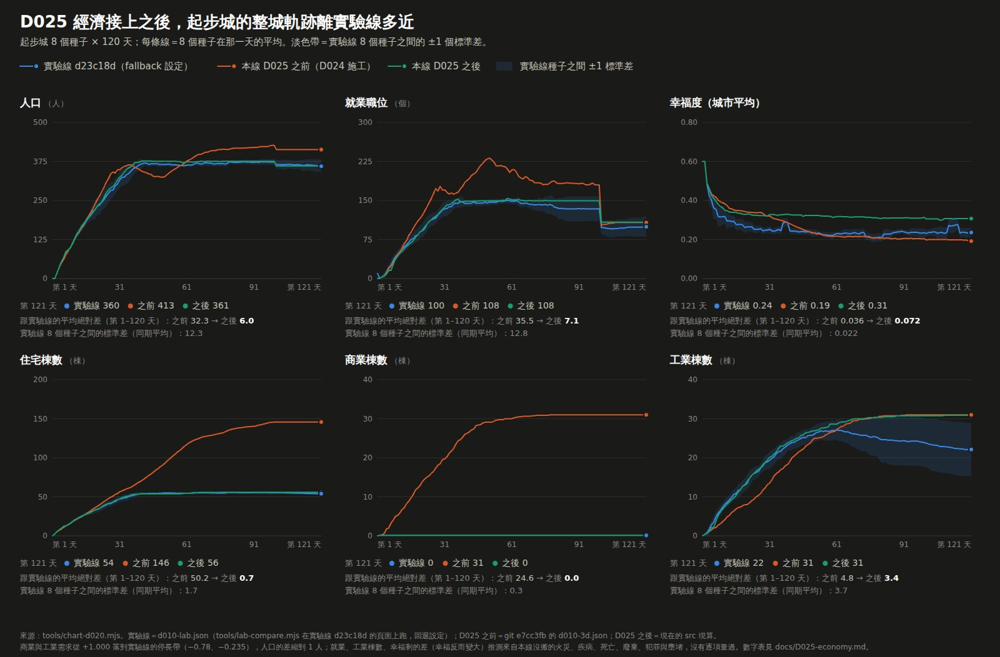

# D025 經濟（一）：共享貿易池、商品庫存、零售與購買力、經濟快照與需求、稅率乘數、進口費

**基線**：D024 施工（`e7cc3fb`，見 `LOG.md` r24）
**參考**：2D 實驗線 `lijiabao1998/GlimmerTown-lab` @ `d23c18d`（v13.43），只讀。行號都指 `index.html` @ `d23c18d`。
**授權**：業主 2026-09-28：「全部做完吧」。這是 [backlog](city-systems-backlog.md) 的 B（經濟快照 T481／T482），D022 卡「不做什麼」、D024 卡「不做什麼」都把它留在這裡。B 一張太大，切兩張：**這一張做到「經濟快照寫出、隔天的需求讀進去、稅率乘數與進口費接上、庫存進存檔」**；天然氣→化肥／熟食（T346）與其餘收入加成（農牧金幣、旅宿、市場、釀酒、科技、數據中心）留給下一張（D026）。

## 為什麼做這張

- **整城軌跡差距的最大一塊**（D010 起就記了，D020、D022、D023 都再確認）。起步城 8 種子第 120 天（`d010-3d.json` 對 `d010-lab.json` 回退設定，均值）：商業需求 **本線 +1.000、實驗線 −0.777**，工業需求 **+1.000、−0.235**，職位 107.5 對 99.5，人口 413 對 360。差在哪：實驗線每天算一份「經濟快照」（購買力、零售利用率、商品缺貨、出口訊號、工業市場乘數），**隔天**的商業與工業需求讀它（55585 `economyDemands481`）；本線沒搬，商工需求走舊式。
- **稅與錢也是**：實驗線的商業稅乘 `commerceSalesMul481`、工業稅乘 `industrialMarketMul481`、`steelTaxMul`、`fuelTaxMul`、`freightTaxMul`、`indSupplyMul`；本線的 `settleToday` 一律給中性值 1（`neutralTaxMul`），D022 算好的遊客數也沒傳進商業稅（`TaxMul.tourists` 一直是 0）。維護費另有六種商品的進口費（56025），本線一律 0。
- **動手前先量了實驗線**（回退設定，唯讀，同 D010 的跑法：新頁面、`GV.importCode`、`GV.step(1)` 逐日；探針是記憶體副本裡一個只讀出口，原檔不動；下面的數字是那一跑讀到的，量測腳本是一次性的、沒進版本庫，正式的對拍工具 `tools/d025-lab.mjs` 會重錄同一批並存成樣本）：
  - **起步城**（種子 5162026）：路 185 格，貿易額度 3（全被糧食用完，`floor(3×.756)＝2` 被「有路至少 3」的下限蓋掉）；購買力 0.57–0.87；零售能量 0（沒有二級以上有電的商業，`nComG284＝0`）→ 零售利用率 0 → 商業需求 −0.70～−1.00；工業市場乘數 0.78、商業銷售乘數 0.80–0.91；進口費每天 4（第 1 天 9）。
  - **鋼的庫存 3→4，從此不動**：企業層關（回退設定）時 `enterpriseTypeUtilization489` 一律 1，所以 `steelBase482＝ceil(12×1)＝12`（55365，「有鋼鐵基礎設施才成立」那句條件在企業關時永遠成立），每個有路的城每天拿貿易池剩下的額度進口鋼；起步城第 1 天糧食不用額度、鋼進 3，第 2 天進 1，第 3 天起糧食用完額度、鋼停在 4。庫存 > 0 ⇒ `steelTaxMul＝1.12`（55323）、`steelDisc418`（升級折扣 ×.85）。**這是回退設定的行為**，不是實驗線預設設定的行為（預設設定企業層有真實利用率）；跟 D010 卡一樣，回退設定是「本線接的回退值」，不是可追的最終目標。
  - **道路負載**（`roadLoad`，T129 壅堵，屬 backlog C）：起步城平均負載 0.37、過載路格 10.8%；`logisticsEfficiency481` 的壅堵扣分＝`max(0, 平均−.65)×.35＋過載比例×.22`＝0.024 → 效率 0.756（不壅堵是 0.78）。額度 `floor((3＋…)×效率)` 在起步城、AI 城（路 425 格，額度 4）都被下限或整數吃掉，**這兩座城壅堵對額度沒有影響**；貨運大城（額度大）才會差一兩單位。所以壅堵當**輸入**：本線沒搬 C，平均負載與過載比例一律 0；對拍時實驗線那天的值代進去。
  - **讀進來的城**（讀檔後第 1 天）：AI 城（人口 1,116）額度 4、進口費 13；種子城（451 格路）額度 42 全用完、零售能量 291.2（讀檔蓋的建築 `pw:true`，第 2 天起沒電、能量歸 0）、缺貨 1、進口費 56；全種類樣張城（沒有路）額度 11、零售能量 2.4、利用率 3.5、進口費 15；物流城 E5（D024 自造：貼路的物流設施）額度 139、燃料 24、鋼 12、進口費 122、隔天 23——燃料與鋼的進出口會來回。
- **這張要補的洞（D022、D024 都指過）**：`foodPreserveMul485`（冷藏庫、穀倉，D022 給 1）、物流九種設施的有效座數與貿易額度各項（D022 給 0）、船（`Math.min(shipCount, …)`，D022 給 0）、`TaxMul.tourists`。

## 施工前查到的事（只讀）

- **每天的順序**（`tick()`，整段沒有亂數）：
  0. 55262–55266 資源回收廠（k111）產貨物（D020 卡「沒做成的事」2）：垃圾那一段之後，正式清運時逐清運區 `min(round(區需求×.08), 區內回收廠數×6)`，舊式時 `min(round(垃圾×.08), 回收廠數×6)`，加進 `goods`，上限是 `goodsCap283()`——**用的是昨天的 `gWhCap284`**（今天的在 55328 才算）。
  1. 55286–55291 T485 單位與上限：物流九種＋貨運中心＋倉儲的**有效座數**（`enterpriseEffectiveCount489(k, n)＝n×利用率`，企業關＝n；物流各種用 D024 的「運作中」座數 `clOp485…cportOp485`）→ `freightUnits485`、`warehouseUnits485`、`portEquivalent485`、`railUnits485`、`fuelCap485`、`steelCap485`、`foodPreserveMul485`、`goodsCapBonus485`。
  2. 55293–55299 食物與遊客（D022 搬了；`foodPreserveMul485` 從 1 改成算出來的值）。
  3. 55302–55326 T364b／T418 深加工鏈：煉油（`fuelMade`）、煉鋼（`steelMade`）、供應品入庫、造船耗鋼（`steelUsed`）、貨運耗油（`fuelUse418`）與貨運稅乘數、船（`shipProgress`、`shipCount`，30 鋼 1 艘、上限＝港口×2）與每日貿易金、燃料與鋼材稅乘數、造船貿易乘數與港口金。**開採量給 0**（backlog M），所以 `fuelMade`、`steelMade` 恆 0，供應品只靠進口。
  4. 55328–55413 T481／T482：貨物倉容量、勞動市場、外部價格（`externalPrice482`：day、季節的正弦）、財富力（`wealthPower481`）、購買力（`purchasingPower481`）、物流效率（`logisticsEfficiency481`）、**共享貿易額度 `tradeCapacity481`**，然後照固定順序用同一池：**糧食進口 → 天然氣進口 → 燃料進口（有償付能力才補）→ 鋼進口（同）→ 供應品進口（同）→ 貨物進口（零售缺貨）→ 糧食出口 → 天然氣出口 → 貨物出口**；一般工業用供應品做貨物（`gMade384`）、零售（`retailCapacity481`、`gNeed284`、`supplyRate481`）、價格（`goodsPrice481`、`costOfLiving481`）、四個乘數（`goodsMul284`、`commerceSalesMul481`、`industrialMarketMul481`、`indSupplyMul`）、太空研究中心每 24 天一輪（供應品夠 180 就花掉、每座換 $3,500）。
  5. 56000–56002、56018–56020：**燃料出口與鋼材出口在 55990 之後才抽池**（在貨物出口之後），各自扣庫存、算出口金。
  6. 56025：出口金、船的金幣進收入；六種商品的進口費進維護費。
  7. 56030–56046：寫 `economy481`（隔天 55585 的需求讀它）、`economy482`、`logistics485`。讀檔（66952–66959）與新圖（51110–51125）：`sup`、`gds`、`fuel364`、`steel364`、`shipCount`、`shipProgress` 還原或歸零；`gWhCap284` 讀檔時由存檔裡的倉儲（k64，每座 120＋(等級−1)×60）重算、新圖 0；快照 `ready＝false`（讀檔第一天商工需求走舊式）。
- **回退設定下各個開關的值**（`tools/lab-configs.mjs` fallback）：企業關 → 利用率 1；`gpn508` 關 → `gpnTradeCapacityMul508()＝1`、`gpnImportAvailability508(id, n)＝n`、`gpnExportDemand508(id, n)＝n`；商業循環關 → `businessCycleConsumptionMul490()＝1`；沒有政策 → `pol?.emergencyStockpile492` 假、`pol?.taxR||1＝1`；沒有城市事件；舊版供電 → `power471.pools` 沒有 → `powerGasDispatch482()＝0`；火車線沒有 → `railLines463.length＝0`；事故 T493 關。
- **輸入哪些本線有、哪些沒有**：有——所有計數（D022、D024）、人口、職位、遊客、幸福、勞動市場（`laborMarket481` D009 搬了）、每棟住宅的財富級 `we` 與居民 `residentPopulation488`、施工中的房屋（`age < 9`）、錢；沒有——道路負載（C）、火車線（T463）、開採量（M）。
- **本線現況**：`day.ts` 的 `foodDay` 已含一份貿易額度（D022，物流各項給 0）；`economyDemands481` 已有讀快照的那一支（`EconomySnap`），目前一律傳 `null`；`money.ts` 的 `TaxMul`（`goodsMul284`、`commerceSalesMul481`、`industrialMarketMul481`、`indSupplyMul`、`fuelTaxMul`、`steelTaxMul`、`freightTaxMul`、`tourists`）與 `ImportCosts`（六種進口費）、`OtherIncome` 都有接口，`settleToday` 目前給中性值。

## 做什麼

1. **`src/sim/rules/economy.ts`（新）**：`economyDay(state, inputs)`——上面第 1、3、4、5 項的純邏輯，回傳「當天的每一個實驗線變數」（同名）、更新後的庫存、乘數、進口費、出口金、快照。壅堵、火車線、開採量、事故當輸入（本線給 0／恆可用）。D022 的 `foodDay` 拆成「食物與遊客」與「糧食供給」兩段，供給那一段搬進 `economyDay`（額度是共用池，糧食排第一個拿）；`foodDay` 的簽名與回報欄位不變（D022 守衛照舊）。
2. **`src/sim/day.ts`**：跨日狀態 `Sim.econ`（`goods`、`supplies`、`fuel`、`steel`、`shipCount`、`shipProgress`，加昨天的快照 `snap`；讀檔與新圖照上面的規則）；每天在 55286 的位置叫 `economyDay`，糧食加減用它算的供糧率；隔天的需求讀快照（`economyDemands481(…, snap)`）；`settleToday` 用 `economyDay` 的乘數與進口費與出口金取代中性值，遊客數傳進商業稅；施工中的房屋數照 55364 的算法數（`age < 9` 的根格）；資源回收廠產貨物（55262–55266）接在 `garbageDay` 之後、用昨天的 `gWhCap284`。
3. **`src/io/save.ts`、`simFromSave`**：`sup`、`gds` 每次寫；`fuel364`、`steel364`、`shipCount`、`shipProgress` 非零才寫（實驗線 66763–66769 同寫法）；讀檔還原、缺欄位＝0、快照 `null`、`steelDisc418＝steel>0`。世界歷史不變（庫存不進歷史）。
4. **介面**：商業與工業的建築卡各多一列「市場」（商業：購買力、零售利用率、銷售乘數；工業：市場乘數、供應品）；讀檔或新圖推進一天之前照實講「推進一天之後才算得出來」（同 D022 的「糧食」列）。
5. **守衛與工具**（新）：`tools/lab-economy.mjs`（實驗線原文黃金樣本 `src/content/samples/d025-economy.json`）、`tools/unit-d025.mjs`、`tools/d025-lab.mjs`（實驗線頁面實跑，出口在記憶體副本）、自造城（物流、庫存、零售、缺貨、出口各一組，接 D024 的組裝器）；`tools/lab-compare.mjs` 多記經濟欄位。D010／D011／D012／D015 的回歸錨點與預建城對拍因為稅乘數、進口費、需求都變了，**照 D020、D022 的做法重錄**，卡面記重錄前後的差。

## 不做什麼

- **開採量與資源圖**（backlog M）：`suppliesGain`、`oilGain`、`oreGain` 給 0；有油井、礦場的城，供應品、燃料、鋼材的**開採那一段**只量不判。
- **道路負載與壅堵**（backlog C）：`logisticsEfficiency481` 的壅堵扣分吃輸入，本線給 0；本線自己推進的城效率比實驗線高 0.02 左右（起步城量到 0.756 對 0.78）。
- **火車線 T463**、**事故 T493**、**政策 `pol`**（緊急儲備、稅率）、**城市活動 T299**、**企業 T489**、**`gpn508` 航運網**、**商業循環 T490**、**夜間城市 T487**、**專業化 T386**：本線沒有，照回退值。
- **天然氣供需帶動的化肥、熟食、工資指數（T346）與其餘收入加成**（農牧金幣、溫室、旅宿、市場、釀酒、加工、科技園區、數據中心、銀行利息）：下一張（D026）。這張只做池裡的進出口與它們直接產生的金幣（糧食出口、天然氣出口、貨物出口、燃料出口、鋼材出口、船）。
- **本線的施工工具**：不做（煉油廠、鋼鐵廠、物流設施等都只在讀進來的城裡有）。

## 驗收（動手前寫）

1. **出處**：實驗線 `d23c18d` 的原文（常數、`goodsCap283`、`foodPriceOf`、`wealthPower481`、`logisticsEfficiency481`、`purchasingPower481`、`externalPrice482`、`COMMODITY_META482`、T485 單位 55286–55291、深加工鏈 55302–55326、經濟 55328–55413、出口兩段、存檔與新圖的還原）逐段 sha256＝錨點記錄；`tools/lab-economy.mjs`。
2. **逐項相等（vm）**：實驗線原文在 Node `vm` 裡跟本線 `economy.ts` 吃同一批隨機輸入，**每個中間量逐位相等**：T485 各單位與上限、深加工鏈的產出與庫存與乘數、`tradeCapacity481`、六種商品各自的進口與出口與庫存與進口費與出口金、貨物產量與零售與缺貨與價格、四個乘數、快照的每個欄位（含 `toFixed` 的位數）、太空研究中心那一輪。隨機輸入涵蓋：庫存為 0／中／滿、有償付能力與沒有、路格 0 到 700、九種物流設施各種座數（運作中與沒運作）、壅堵（平均負載 0 到 1.5、過載比例）、船（進度 0–29、隊數、港口）、人口 0 到 5,000、遊客、季節、`day`（含 24 的倍數）。**連跑三天**，庫存與快照跨日帶。覆蓋守衛：池的每一個進口與出口至少在某些步 > 0，六種商品都有短缺與盈餘的步，船下水、太空研究中心跑輪、破產不補三種各 > 0 步。
3. **實驗線頁面實跑**（回退設定，一座城一個新頁面；探針是記憶體副本裡兩行只讀的記錄：經濟段開頭〔55328 那一行前面〕讀輸入、`tick()` 收尾讀輸出，原檔不動）：
   - **讀檔後第 1 天**：D024 的 103 座城。本線 `economyDay` 吃**本線自己算的**人口、職位、計數、遊客、財富、施工中房屋數、錢——這幾項 D021、D022、D024 已經逐座判過；**幸福**代入實驗線探針讀到的值（本線這一項有已知的差：AI 城存檔裡的政策「公園夜間開放」每棟 +.02，購買力的心情項讀它，D022 卡記過；backlog K）；道路負載讀檔後兩邊都是 0。輸出 `economy481`、`economy482.trade`、六種商品的進口出口庫存、進口費、庫存、四個乘數逐座相等；
   - **多天**（庫存與快照跨日）：起步城 8 種子 × 120 天、AI 城與種子城與物流城各 30 天。每天把實驗線那天經濟段開頭的**輸入**（人口、職位、幸福、計數、路格數、道路負載統計、錢是否 ≥ 0、施工中房屋數、住宅財富與居民）代進本線 `economyDay`，本線從**自己**的昨天庫存與快照接著算，每天的輸出跟實驗線探針讀到的逐位相等（實驗線的亂數流第 2 天起跟本線錯位，所以不比整城，比函式；整城比 7）；
   - D011、D016 預建城對拍的第 1 天收入、維護費、資金：**能不再代入實驗線那天的第 2 類值、直接＝實驗線的就拿掉代入**（預建城是起步城那一類，沒有零售與物流）；拿不掉的說出原因寫進卡面；
   - 守衛在 CI 上重算本線那一半（樣本 `d025-lab.json`），不用瀏覽器。
4. **需求與稅乘數接線**：`day.ts` 隔天的商工需求讀昨天的快照、讀檔第一天走舊式；`settleToday` 的稅乘數、進口費、出口金來自 `economyDay`（不再是中性值），遊客數進商業稅；把其中一處接歪的 `day.ts` 副本，實驗線實跑那批要紅。
5. **存檔**：`sup`、`gds` 每次寫、`fuel364`、`steel364`、`shipCount`、`shipProgress` 非零才寫（實驗線 66763–66769 的寫法，規則 9）；讀了再存逐欄不變；舊檔缺欄位＝0；快照不存（讀檔＝沒就緒）；世界歷史格式不動、庫存不進歷史。其他守衛若比對存檔位元組（D011、D013 的存讀檔往返），多出來的 `sup`、`gds` 兩欄照重錄並在卡面說明。
6. **突變**：實驗線原文改若干處（池的順序、每一個進口／出口的條件、償付能力、每個乘數的係數與夾值、船兌換、太空研究中心、季節價格……）、本線原碼改若干處，整批全紅（處數與全紅的紀錄寫進卡面）；沒改的先核過全等。
7. **整城軌跡重量**（記錄，不判；規則 8 要的是多種子統計一致）：起步城 8 種子 × 120 天，實驗線（回退設定）｜D025 之前｜D025 之後，商業與工業需求、職位、人口、幸福、資金的均值與標準差；預期商業需求落到實驗線的停長帶（約 −0.7）、工業需求 −0.235 上下。不一致的部分（例如壅堵、通勤、疾病等沒搬的系統帶來的）要在卡面說出來源。
8. **介面**：商業與工業的建築卡有「市場」一列；讀檔後沒推進過講實話。
9. 本機型別、Node 守衛（Node 22 與 24）、建置、煙霧全綠；`main` 的 Actions 綠。

## 施工紀錄

- 卡：`d69a8c3`（只有這張卡，驗收條件先寫）。施工：`64927ce`（一個提交：程式、守衛、樣本、樣張、卡面；隨後一個提交只更新 `d015-golden.json` 的錄製點標籤——場景摘要 10 個情境逐字相同，錄在 `afb8b58` 的那份是本機暫存提交、已併進 `64927ce`）。

### 做了什麼

1. **`src/sim/rules/economy.ts`（新，379 行）**：`recycleGoods`（55262–55266 資源回收廠產貨物，用昨天的倉容量）、`economyMain`（55328–55413：貨物倉容量、外部價格、財富力、購買力、物流效率、共享貿易額度 `tradeCapacity481`、六種商品的進口與出口、貨物與零售與價格、四個乘數、太空研究中心每 24 天一輪；糧食那一段呼叫 D022 的 `foodDay`，跟著同一個池）、`steelConstruction`（55664–55671 煉鋼廠加速施工）、`economyLate`（55991–56021 燃料與鋼材出口、出口金）、`economySnapshots`（56030–56046 寫 `economy481`、`economy482`、`logistics485`）、跨日狀態 `EconState`（貨物、供應品、燃料、鋼材、船數、造船進度、昨天的倉容量、昨天的快照）。全部是純函式，不碰 three、DOM、`Math.random`、現實時間（規則 2、3）。
2. **`src/sim/rules/logistics.ts`（新）**：T485 的單位與上限（`unitsOf485`：貨運、倉儲、港口當量、鐵路、燃料上限、鋼材上限、冷藏加成、貨物倉加成）與道路負載的輸入型別 `RoadStats`。
3. **`src/sim/rules/food.ts`**：`foodDay(c, roads, pop, sea, day, x)` 多一個 `FoodX`（單位、道路負載、船數、燃料乘數、城市活動的食物加成）；D022 的守衛照舊（`x` 預設全是中性值）。
4. **`src/sim/day.ts` 接線**：每天的順序改成「計數 → 垃圾 → 資源回收產貨物 → 勞動市場 → 經濟 → 糧食加減 → 需求（讀昨天的快照）→ 成長與升級 → 煉鋼廠加速施工 → 財富評分 → 出口與快照 → 結算（稅乘數、其他收入、進口費）」；太空研究中心的獎金直接入帳；`Sim.econ` 進 `simHash`；`DayReport.econ`、`SettleReport.tax` 多回報。`Class2In.economy`（幸福、道路負載、火車線、發電調度、城市活動的食物加成）與 `nightCommerceGold487`、`eventTax` 是**測試才用**的覆蓋值：本線沒有這幾項的來源，守衛拿實驗線探針讀到的值代進去。
5. **`src/io/save.ts`**：`sup`、`gds` 每次寫；`fuel364`、`steel364`、`shipCount`、`shipProgress` 非零才寫（庫存用完，範本裡讀進來的舊值要拿掉）；讀檔 `(+x)||0`。
6. **`src/cityView.ts`**：商業建築卡「市場」列（購買力、零售利用率、貨物需求本地＋進口、銷售乘數）、工業建築卡「市場」列（市場乘數、缺貨、貨物庫存、原料）；沒有當天回報時寫「推進一天之後才算得出來」。
7. **守衛與工具（新）**：`tools/lab-economy.mjs`（實驗線原文 28 段 → `src/content/samples/d025-economy.json`）、`tools/unit-d025.mjs`（vm 逐項對拍、突變、等價突變的前提）、`tools/d025-cities.mjs`（自造城 G1–G17）、`tools/d025-lab.mjs`（實驗線頁面實跑，探針在記憶體副本，樣本 `d025-lab.json`）、`tools/unit-d025-live.mjs`（樣本重算、接線突變、存檔）。
8. **順帶改的舊守衛**：D011 對拍不再代入實驗線的經濟值（`tools/d011-parity-lib.mjs` 的 `class2Of`）、D022 接線守衛改讀 `economy.ts`、D024 維護費守衛不再扣進口費、D011 沙盒守衛自己升級一批房屋（起步城沒有 2 級了，見卡面更正 6）、煙霧三處（見卡面更正 7）。

### 卡面更正（動手之後才改的）

1. **函式名**：卡寫 `economyDay(state, inputs)`。實作拆成五個函式：`recycleGoods`、`economyMain`、`steelConstruction`、`economyLate`、`economySnapshots`——實驗線的這幾段在 `tick()` 裡不相鄰（55262、55328、55664、55991、56030），拆開才能照原順序穿插在 `day.ts` 裡。`foodDay` 沒有拆成兩段：它保留原簽名加一個 `FoodX`，額度池由 `economyMain` 傳進去，糧食排第一個拿的順序不變。
2. **卡「做什麼」沒寫到、實驗線 `tick()` 裡有的三件事**：(a) 55664–55671 煉鋼廠加速施工（有煉鋼廠時，每天最多 `min(煉鋼廠數×2, 鋼庫存)` 棟施工中〔`age < 9`〕的房屋屋齡 +1，起點輪轉 `day % 施工中座數`，每加速一棟鋼庫存 −1，耗鋼進快照 `constrSteelUse418`）；(b) 太空研究中心的獎金入帳（每座 $3,500，`mgReward`；提示與音效不搬）；(c) 資源回收廠產貨物在卡的「查到的事」寫了、「做什麼」沒列，這裡補進 `recycleGoods`。
3. **城市活動 T299 在回退設定下照樣會發生**（卡「不做什麼」寫「本線沒有，照回退值」）：實驗線每 37 天一場，食物點數乘 1.5／.7／1.1／.9，總稅收另乘一個數。**動手前沒查到**，是多天實跑時實驗線的食物點數對不上才發現的。本線沒有 T299（backlog D），所以生產路徑一律當 1；守衛把實驗線那天的乘數當輸入代進去（`eventFood`、`eventTax`），公式層逐位相等。整城軌跡上這是一個沒搬的變動源。
4. **夜間城市 T487 的商業加成金幣**（`nightCommerceGold487`）：回退設定沒有 `nightCity` 旗標所以是 0，但守衛的自造城裡有些城會讀出非零，同樣當輸入代進去。
5. **驗收 3 的第三項（D011、D016 預建城對拍能不能拿掉代入）**：D011 新城 8 個種子第 1 天的收入、維護費、結算後資金**不再代入實驗線的經濟值**，本線自己算，資金差 0.0000 ± 0.0000（守衛從「只量不判」改成判）；預建城那一組本來就只比「第 2 類系統起作用之前就定案」的部分，沒有變。D016 的對拍沿用 `class2Of`，同樣不再代入經濟值。
6. **起步城已經沒有 2 級以上的建築**（卡沒預料到）：實驗線回退設定的起步城 8 個種子，120 天內住商工沒有一棟升級（`d010-lab.json` 第 121 列的 R2、R3、C2、I2 全是 0）。本線以前靠商工需求恆 +1 才升級；D025 之後跟實驗線一樣沒有。連帶三個舊守衛的前提消失：D011 沙盒守衛（改成測試裡自己把每三棟住商工升到 2 級、寫升級事件）、煙霧 D010「卡片開著時升級」（改用 AI 城當「我的城」）、D015 驗收 5（見下）。
7. **煙霧紅過一次、根因與處理**（第一輪 249 項綠、3 項紅，全是這張的正常後果，沒有一項是壞掉）：(a) D010 升級——同上 6，換 AI 城（第 121 天讀進來，挑一棟先升 2 級、之前沒有 grow 事件的住宅，開著卡、推進、卡上的等級跟著變）；(b) D012 建築卡逐列比對，32／91 棟不同：新的「市場」列跟「清運」「糧食」一樣是當下狀態，讀檔前後不比（一併排除）；(c) D015 驗收 5 只湊到 1 對（要 ≥ 10）：起步城長得少，前面驗收 2 走完 60 天就長完了、之後沒有自然重建。**重讀起步城從頭量湊得到 16 對，但比值中位數 0.53 > 0.5**——起步城現在只有約 100 棟，整張重建 13 ms、增量的固定成本（同步工地 6 ms）佔了一半；這條驗收的對象本來就是大城，所以量測改在 AI 城（399 棟）當「我的城」上：18 對、比值中位數 0.18–0.22（最小 0.14–0.15、最大 0.32–0.39）、增量 10–14 ms、整張 60 ms。**這不是把門檻放寬，而是換到量得出意義的城**；起步城小城增量不到一半的事實照實記在這裡。

### 施工中遇到、照實記下

1. **突變沒抓到的先後**（第一批 payload 的結果）：財富力社宅（沒有 `wa` 的輸入）、償付能力（`money>=0` 的邊界靠運氣）、貨物價格上限（要在熱門日）、船兌換／燃料進口上限／鋼出口（要特殊輸入）。做法：加輸入家族（`small、econ、logi、food、steel、mega、roads、rich、shop、yard、heavy、pricey、jam`）、邊界值、`bump` 掛勾（在實驗線原文兩個位置之間強制一個值）、事件（0–3 號城市活動）、`HOT_GOODS` 日子。
2. **等價突變的處理**：有些突變改的地方在輸入範圍內碰不到（例如購買基準下限 .40 改 .45：實際最小值就是 .45；商業銷售上限 1.18 改 1.19：實際最大值 1.171；倉儲單位是 .5 的倍數所以位數突變看不出來）。做法不是留著假裝抓到，而是換成範圍內碰得到的鄰居（購買基準 .40→.50、商業銷售上限 1.18→1.12、工業市場上限 1.22→1.10、糧價上限 1.80→1.55、倉儲單位位數 toFixed(1)→(0)），並加一項「等價突變的前提」守衛，把這批輸入實測的最大最小值印出來、要求都落在原上限之內或之外。兩個死突變（船的額度上限、貨櫃物流有效座數位數）刪掉。
3. **樣本大小**：多天列每天完整輸出，第一版 5.8 MB；改成每天只記雜湊與純量（`compactB`），逐天比對時本線重算同一份雜湊，樣本 1.3 MB。
4. **重播的漏洞**：多天重播時我漏了 `st.snap = sn.economy481`（昨天的快照），購買力的生活成本 fallback 到 `foodPriceOf`，差一點點；守衛紅，補上。
5. **`pkill -f` 殺到自己的 shell**（退出碼 144），沒有影響檔案。

### 驗收結果（施工後）

1. **出處** ✅（驗收 1）：實驗線 `d23c18d` 的 28 段原文（六商品表 38278、貨物與進出口價 38261、庫存與深加工與船與太空研究中心的常數 39449–39660、貨物倉容量 38202、農產價格 38203、勞動市場 38264、財富力 38268、購買力 38270、外部價格 38298、商品欄 38299、資源回收廠產貨物 55262–55266、深加工鏈 55305–55325、經濟 55328–55413、煉鋼廠加速施工 55664–55671、出口與出口金 55991–56021、快照 56030–56046）逐段 sha256＝錨點記錄；六商品表與各個常數跟本線相同。
2. **逐項相等（vm）** ✅（驗收 2）：實驗線原文在 Node `vm` 裡跟本線 `economy.ts`、`food.ts`、`logistics.ts` 吃 1,040 張隨機小圖、每張連三天共 3,120 步（庫存、船、倉容量、快照跨日帶），T485 各單位、深加工鏈、貿易額度、六種商品的進口出口庫存進口費出口金、貨物與零售與價格、四個乘數、快照三份、資金、施工中房屋的屋齡，實驗線那一段的**每一個區域變數每一步逐位相等**：3,120 步全等。覆蓋（步數）：糧食進口 2,410、天然氣進口 471、燃料進口 373、鋼進口 400、供應品進口 185、貨物進口 209、糧食出口 80、天然氣出口 47、貨物出口 198、燃料出口 298、鋼出口 287；破產不補 604＋跳過 496；船下水 772（船金 318）；太空研究中心跑輪 44；施工耗鋼 152；額度大於 3 的 2,543；效率 < .78 的 612、> .78 的 2,115；池被用乾的 2,230；燃料上限束縛 71、鋼出口被擋 14。資源回收廠另一段：4,000 組（逐區清運 1,368、正式但不逐區 592、舊式全城 2,040，三類合計 4,000；有加 2,145、頂到上限 94、原本就超過上限 956）全等。
3. **實驗線頁面實跑** ✅（驗收 3；回退設定，一座城一個新頁面，探針是記憶體副本裡兩行只讀，原檔不動）：
   - **讀檔後第 1 天**：120 座城（D022 的 80 座、D023 的 9 座、D024 的自造城 14 座、D025 的經濟自造城 17 座）。本線自己讀檔、算人口、職位、計數、財富力、施工中房屋、錢、遊客；只把本線沒有的五樣輸入（幸福、道路負載統計、火車線、發電調度、城市活動的食物加成）用實驗線探針的值蓋過去。`economy481`、`economy482`、`logistics485` 三份快照、庫存與船與倉容量、四個稅乘數與其他乘數、六種進口費、各項出口金、施工耗鋼、結算前的錢，**120 座全等**；收入（扣掉本線沒搬的收入項）**103 座判、17 座只量不判**（見下「收入只量不判」）。覆蓋：有進口 118、有出口金 3、有貨物庫存 9、有燃料 5、有鋼 17、有船 1、有供應品 3、太空研究中心 1、施工耗鋼 3、額度大於六 23、遊客 29、有壅堵 4；**有火車線 0、有發電調度 0**（這兩項只有 vm 隨機輸入蓋到，沒有實驗線頁面的實例）。
   - **連續推進**：起步城 8 個種子 × 120 天（960 城日）＋AI 城、種子城、G2 貨物出口、G4 物流、G5 船、G7 太空研究中心、G8 加速施工、G9 糧食加工與出口各 30 天（240 城日），共 **1,200 個城日全等**：每天把實驗線那天經濟段的輸入代進本線、本線從自己的昨天庫存與快照接著算；三份快照、庫存、稅乘數、進口費、出口金、結算前的錢與隔天的商工需求（讀昨天的快照）逐天相等。覆蓋：有進口 1,200、有出口金 30、有船 30、有燃料 11、有鋼 1,063、施工耗鋼 5、零售利用率 > 0 的 181。
   - **D011 新城 8 個種子第 1 天的資金**：不再代入實驗線的經濟值，本線自己算，資金差 **0.0000 ± 0.0000**（守衛從「只量不判」改成判；卡面更正 5）。
   - 守衛在 CI 上重算本線那一半（樣本 `d025-lab.json`，1.3 MB），不用瀏覽器。
   - **收入只量不判的 17 座**（本線沒搬、收入差的來源；守衛對每一座都列出原因，本線−實驗線）：大型購物中心 k65 的稅 **7** 座（gallery −179.52、E6 −231.39、E8 −159.86、E10 −206.30、E12 −429.69、E13 −137.97、G13 −182.24；本線比實驗線少收）、火災／疾病／死亡／廢棄使 1 棟建築停稅 **9** 座（F1 +6.32、F2 +10.19、R3 +3.27、A1 +6.32、B7 +6.48、C4 +6.48、SB1 +6.32、E11 +3.30、G1 +1.80；本線多收）、政策 **1** 座（ai120 −5.11）。7＋9＋1＝17。
4. **接線** ✅（驗收 4）：`day.ts` 的副本改壞一處要紅——12 個（資源回收廠、路格數、煉鋼廠加速施工、施工耗鋼進快照、稅乘數、遊客、出口金、進口費、幸福的來源、獎金入帳、隔天的需求讀快照、存快照）；沒改的先核過全等；資源回收廠拿掉紅 4 座、貿易額度的路格數給 0 紅 113 座、煉鋼廠加速施工拿掉紅 3 座、快照的施工耗鋼給 0 紅 3 座、稅乘數不傳給結算紅 59 座、遊客數不進商業稅紅 4 座、出口金不進收入紅 3 座、進口費不進維護費紅 118 座、經濟讀的幸福差一點紅 108 座；獎金入帳少 7,000 紅；隔天的需求不讀快照、快照不存，第二天的需求變了紅。
5. **存檔** ✅（驗收 5）：`sup`、`gds` 每次寫，`fuel364`、`steel364`、`shipCount`、`shipProgress` 非零才寫（庫存用完，範本讀進來的舊值要拿掉）；讀進來的庫存與船＝存檔欄位（缺＝0）、倉容量從倉儲物流中心重算、快照 null；存了再讀、讀了再存逐欄不變；同一張碼讀兩次、各推三天雜湊相同（庫存與快照進雜湊）：8 座城（G2 貨物 180、G4 鋼 18、G5 船 4 …）。**其他守衛的存檔位元組**：本線匯出的碼多了 `sup`、`gds` 兩欄，D011、D012、D013、D016、D019、D020 的黃金樣本與實驗線讀回樣本照重錄（見下「重錄的樣本」）；實驗線照樣讀得進來（D011、D013、D016、D019、D020 的「本線的碼給實驗線讀」守衛全綠）。
6. **突變** ✅（驗收 6）：實驗線原文 **127 個**（含資源回收 12）、本線原碼 **137 個**（含資源回收 13）全紅：池的順序、每一個進口與出口的條件與係數、償付能力、每個乘數的係數與夾值、船兌換、太空研究中心、季節價格、單位與額度、快照的位數……；沒改的先核過全等。**等價突變的處理見「施工中遇到」2**（改的地方輸入碰不到的，換成碰得到的鄰居，並用一項守衛把實測範圍印出來）。
7. **整城軌跡** 📊（驗收 7，記錄不判；起步城 8 種子 × 120 天，均值 ± 種子間標準差；實驗線＝`d010-lab.json`（`d23c18d`、回退設定）、D025 之前＝git `e7cc3fb` 的 `d010-3d.json`、D025 之後＝現在的 src 現算；列是第 N 列＝第 N−1 天）：

   

   | 列 | 量 | 實驗線 | D025 之前 | D025 之後 |
   |---|---|---|---|---|
| 第 31 列 | 商業需求 | -0.700 ± 0.013 | 1.000 ± 0.000 | -0.707 ± 0.010 |
| 第 31 列 | 工業需求 | -0.235 ± 0.000 | 0.990 ± 0.017 | -0.235 ± 0.000 |
| 第 31 列 | 住宅需求 | -0.503 ± 0.036 | -0.168 ± 0.368 | -0.484 ± 0.089 |
| 第 31 列 | 人口 | 315.9 ± 27.9 | 348.3 ± 9.7 | 323.8 ± 30.1 |
| 第 31 列 | 就業職位 | 133.6 ± 13.8 | 170.3 ± 19.8 | 137.1 ± 13.4 |
| 第 31 列 | 幸福度 | 0.252 ± 0.018 | 0.320 ± 0.011 | 0.328 ± 0.015 |
| 第 31 列 | 住宅棟數 | 47.3 ± 3.7 | 56.4 ± 1.6 | 47.3 ± 4.3 |
| 第 31 列 | 商業棟數 | 0.1 ± 0.3 | 19.8 ± 1.1 | 0.1 ± 0.3 |
| 第 31 列 | 工業棟數 | 19.4 ± 2.3 | 13.5 ± 1.0 | 20.1 ± 1.4 |
| 第 61 列 | 商業需求 | -0.721 ± 0.008 | 1.000 ± 0.000 | -0.724 ± 0.021 |
| 第 61 列 | 工業需求 | -0.235 ± 0.000 | 1.000 ± 0.000 | -0.235 ± 0.000 |
| 第 61 列 | 住宅需求 | -0.573 ± 0.054 | 0.185 ± 0.334 | -0.576 ± 0.039 |
| 第 61 列 | 人口 | 363.1 ± 4.2 | 376.3 ± 9.7 | 373.6 ± 3.4 |
| 第 61 列 | 就業職位 | 148.5 ± 5.6 | 208.6 ± 16.4 | 151.1 ± 3.3 |
| 第 61 列 | 幸福度 | 0.230 ± 0.008 | 0.217 ± 0.007 | 0.318 ± 0.015 |
| 第 61 列 | 住宅棟數 | 54.6 ± 1.0 | 117.1 ± 3.5 | 54.5 ± 1.3 |
| 第 61 列 | 商業棟數 | 0.1 ± 0.3 | 30.0 ± 0.9 | 0.1 ± 0.3 |
| 第 61 列 | 工業棟數 | 27.1 ± 2.7 | 27.3 ± 1.3 | 28.6 ± 1.3 |
| 第 121 列 | 商業需求 | -0.777 ± 0.005 | 1.000 ± 0.000 | -0.780 ± 0.000 |
| 第 121 列 | 工業需求 | -0.235 ± 0.000 | 1.000 ± 0.000 | -0.235 ± 0.000 |
| 第 121 列 | 住宅需求 | -0.821 ± 0.084 | -0.916 ± 0.002 | -0.846 ± 0.033 |
| 第 121 列 | 人口 | 359.6 ± 21.3 | 413.0 ± 0.0 | 360.5 ± 3.5 |
| 第 121 列 | 就業職位 | 99.5 ± 19.2 | 107.5 ± 4.5 | 108.3 ± 3.3 |
| 第 121 列 | 幸福度 | 0.236 ± 0.024 | 0.192 ± 0.012 | 0.307 ± 0.014 |
| 第 121 列 | 住宅棟數 | 54.0 ± 1.4 | 145.8 ± 6.3 | 55.9 ± 1.3 |
| 第 121 列 | 商業棟數 | 0.1 ± 0.3 | 31.0 ± 0.0 | 0.1 ± 0.3 |
| 第 121 列 | 工業棟數 | 22.1 ± 6.8 | 31.0 ± 0.0 | 30.9 ± 0.3 |

   跟實驗線的平均絕對差（8 種子均值軌跡，第 1–120 列平均；括號是實驗線種子間標準差的全程平均）：人口 32.3 → **6.0**（12.3）、就業職位 35.5 → **7.1**（12.8）、住宅棟數 50.2 → **0.7**（1.7）、商業棟數 24.6 → **0.0**（0.3）、工業棟數 4.8 → **3.4**（3.7）、**幸福度 0.036 → 0.072（0.022）——變遠了**。
   - **預期的達成了**：商業需求落到實驗線的停長帶（−0.780 對 −0.777）、工業需求 −0.235 對 −0.235、住宅與商業棟數貼近、人口的差縮到 1 人。
   - **沒有變近、甚至變遠的**：**幸福度**（本線 .307 對實驗線 .236）與**工業棟數／就業職位**（30.9 對 22.1、108.3 對 99.5；實驗線工業棟數第 61 列 27.1 → 第 121 列 22.1 在減少，本線沒有）。D025 之前幸福度的貼近，是本線城市長到 146 棟（實驗線 54 棟）、沒電住宅太多把平均壓低的巧合；現在城的大小對了，這個巧合就沒了。**成因我的判斷是實驗線的火災、犯罪、疾病、廢棄、壅堵（backlog C、E、F、G）本線沒搬，但沒有逐項量過，是推測**。
   - **實驗線種子間 sd 比本線大**（人口 21.3 對 3.5、工業棟數 6.8 對 0.3）：同樣是沒搬的亂數系統（火災、疾病、犯罪）造成的種子間分歧，推測，沒量。
8. **介面** ✅（驗收 8）：商業與工業建築卡有「市場」一列（下圖），住宅沒有；讀檔後沒推進過講「推進一天之後才算得出來」。新的煙霧 `tools/smoke-d025.mjs`：起步城推進到有工業，連三天工業卡的市場列（市場乘數、缺貨、貨物庫存、原料）＝當天快照，住宅的卡沒有這一列；種子城當成「我的城」讀進來，推進之前商業卡與工業卡都講實話、推進一天之後數字＝當天快照（商業：購買力、零售利用率、貨物需求本地＋進口、銷售乘數）。**改壞一處要紅**：市場列的銷售乘數位數、住宅也顯示市場列、沒回報時給一個假數字，三個突變各自轉紅。

   

   （左：種子城當成「我的城」讀進來推進一天，商業卡「購買力 1.10；零售利用率 15%（貨物需求 44：本地 0＋進口 0）；銷售乘數 ×0.98」；右：自造城 G2，工業卡「市場乘數 ×1.01（缺貨 0%、貨物庫存 160／420）；原料 7.2／7.2」。AI 城沒有商業建築，所以商業卡用種子城。）
9. **綠燈** ✅（驗收 9）：`tsc --noEmit` 綠；Node 守衛 **282 項 0 NG**（Node 22 261.6 秒、Node 24 243.7 秒，兩個同時跑；D024 是 272 項）；建置 **1,021,249** 位元組（D024 是 1,002,664，多 18,585）；煙霧 **255 項 0 NG**（471.4 秒，Chromium 141；D024 是 252 項，這張多 3 項＝`tools/smoke-d025.mjs` 的 2 項驗收加「零外部請求、console 零錯誤」；D015 驗收 5 新量在 AI 城上，18 對、比值中位數 0.23、最小 0.13、最大 0.41、增量 10.1 ms、整張 49.4 ms）；煙霧第一輪紅了 3 項、原因與處理見卡面更正 7；`main` 的 Actions：run [36623126431](https://github.com/lijiabao1998/GlimmerTown3D-lab/actions/runs/36623126431)（`77f7e77`）**success**——型別檢查、Node 守衛 3 分 16 秒、煙霧 7 分 50 秒、樣張 5 分 48 秒、Pages 部署；工作階段分支的 run [36623141202](https://github.com/lijiabao1998/GlimmerTown3D-lab/actions/runs/36623141202)（`c201a97`，樹＝main 的併入提交）**success**（3:14／7:50／5:44，Pages 依設定跳過）。兩個 push 同時跑，D015 驗收 5 沒有紅；CI 上的比值數字我沒有去讀日誌（只看了各步驟的結論），所以「CI 上比值多少」沒有記錄。

### 重錄的樣本（驗收 5 的後果，逐個記前後差）

- `d010-3d.json`（起步城 8 種子 × 120 天的回歸錨點）：整份重錄（軌跡見上）。
- `d015-golden.json`：10 個情境裡 **8 個逐字不變**，只有起步城第 60 天、第 120 天兩個變了（經濟改了起步城長多少）；本次錄在 `afb8b58`（D015 首次建黃金樣本的錄製點一路是「當時的 HEAD」，同 D018、D020、D022）。
- `d011-3d.json`（本線那一半的逐日數字與匯出的碼）、`d011-lab.json`、`d012-lab.json`、`d013-lab.json`、`d016-lab.json`、`d019-lab.json`、`d020-lab.json`：全部用 `--lab=../lijiabao1998/glimmertown-lab`（`d23c18d`）在實驗線頁面實跑重錄。**實驗線自己的逐日數字與對帳數字沒有變**（逐項比過）；變的只有：
  - `d011-lab.json`：實驗線讀回本線匯出的碼的 `codeHash`、`plainHash`（各 8 個種子，多了 `sup`、`gds` 兩欄），加計時與秒數，共 49 處。
  - `d016-lab.json`、`d019-lab.json`、`d020-lab.json`：每個種子讀回本線匯出的碼的 `codeHash` 與 `money`（本線第 1 天結算的錢變了：稅乘數與進口費現在是本線自己算的），加秒數，共 17–18 處（`d016-lab.json` 另多一個 `keepNoise: false` 欄位，是錄製工具比舊樣本新）。
  - `d012-lab.json`：2,175 處，全在本線匯出的碼與它衍生的欄位（雜湊、長度、重挑棟數、逐棟列）；88,924 → 86,841 位元組。
  - `d013-lab.json`：預建城推進 5 天匯出的碼，事件 38 → 37、住宅 11 → 10 棟（推測是第 2 天起需求改讀快照，沒有逐日量）；198 處。

### 施工後補記的驗收外事項

- **D015 驗收 4 的邊際**：起步城變小之後「每次重建重做的件數中位數 ≤ 全部的 20%」量到 **17.9%**（以前更低）。件數由模擬決定、不隨機器快慢，CI 上會是同一個數；但離門檻只剩 2 個百分點，之後若再有讓起步城變得更小的卡，這一項會先紅。

### 沒做成的事

1. **道路負載與壅堵**（T129，backlog C）：`logisticsEfficiency481` 的壅堵扣分吃輸入，本線恆給 0；起步城實驗線量到平均負載 0.37、過載 10.8%、效率 .756 對 .78，額度被整數吃掉，**對起步城與 AI 城沒有影響**；貨運大城會差一兩單位。守衛拿實驗線那天的值代進去（120 座裡有壅堵 4 座）。
2. **火車線 T463、發電調度 T471**：本線恆 0；120 座實驗線實例裡**一座都沒有**（有火車線 0、有發電調度 0），這兩項的公式只被 vm 隨機輸入蓋到，沒有實驗線頁面的對照。
3. **資源開採量**（backlog M）：`suppliesGain`、`oilGain`、`oreGain` 給 0；有油井、礦場的城，供應品、燃料、鋼材的開採那一段只量不判（D024 已列）。
4. **企業層 T489（回退設定＝利用率 1）、政策 K、商業循環 T490、gpn T508、專業化 T386**：本線沒有，照回退值。**回退設定的一個怪行為照搬了**：企業層關時 `steelBase482` 一律成立，每個有路的城每天用貿易池剩下的額度進口鋼，起步城的鋼庫存 3 → 4 之後不動、鋼材稅乘數 1.12 從此成立（卡「施工前查到的事」）。這是回退設定的行為、不是預設設定的；要不要退場回退旗標是業主的決定（backlog「要業主定的事」4）。
5. **城市活動 T299（backlog D）**：回退設定下照樣每 37 天一場、食物點數與總稅收另乘一個數（卡面更正 3）；本線沒有，生產路徑當 1，守衛把實驗線那天的乘數代進去。**起步城整城軌跡裡這是一個沒搬的變動源**。
6. **夜間城市 T487 的商業金幣、專業化的稅乘數**：生產路徑一律 0／中性值，只在守衛裡代入。
7. **火災、犯罪、疾病、死亡、廢棄的建築停稅（E、F、G）**：收入只量不判的 9 座城；**大型購物中心 k65 的稅**（55964，新加 backlog N）7 座；政策（K）1 座。
8. **`steelDisc418`（鋼庫存 > 0 時升級折扣 ×.85）**：本線沒有玩家升級工具，沒接。
9. **其餘收入加成與 T346**（農牧金幣、牧場、溫室、加工、旅宿、市場、釀酒、科技、數據中心、熟食、銀行利息；天然氣供需帶動的化肥、熟食、工資指數）：D026。守衛把它們從收入裡扣掉（探針讀出、不進判斷）。
10. **太空研究中心獎金的提示與音效**：只入帳、不彈提示。
11. **卡「做什麼」5 的 `tools/lab-compare.mjs` 多記經濟欄位**：**沒做**。整城軌跡用的是 `d010-lab.json` 原有欄位（需求、棟數、人口、幸福、職位），經濟欄位（庫存、購買力、進出口）沒有逐日的多種子對照；經濟的逐日對拍走 `d025-lab.mjs` 的連續推進（1,200 個城日）。
12. **整城軌跡的成因沒有逐項驗證**：幸福度變遠、工業棟數與就業沒變近、實驗線種子間 sd 較大，我把它們歸因於火災、犯罪、疾病、廢棄、壅堵，這是推測；要證實得在實驗線頁面逐項記每棟住宅的幸福構成與每天的起火、廢棄、病倒事件。
13. **D015 驗收 5 的量測換了城**（卡面更正 7）：起步城小城的增量重建不到整張的一半這件事**做不到**（比值 0.53），改在 AI 城 399 棟上量（0.18–0.22）。
14. **沒上實機**（中階 Android 手機的效能沒量；這張沒有畫面的改動，只多了兩列卡片文字與每天一段純運算）。
