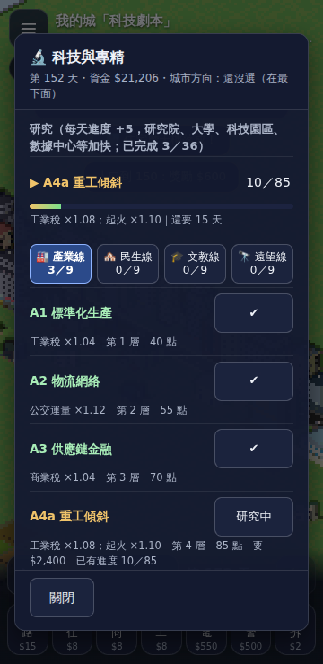

# D038 科技與專精（T343／T386）：研究、四條科技路線、四個城市方向

**基線**：D037 收工（見 `LOG.md` r37）
**參考**：2D 實驗線 `lijiabao1998/GlimmerTown-lab` @ `d23c18d`（v13.43），只讀。行號都指 `index.html` @ `d23c18d`。
**授權**：業主 2026-09-25 起「全部做完」，2026-10-04「全部做完，做完之後匯報」。這是 [backlog](city-systems-backlog.md) 的「科技與專精」支線（D031 起每一張都寫著「實跑守衛的注入只剩科技與專精」）。

## 為什麼做這張

- **科技的「效果」本線早就搬了，缺的是「狀態」**：`tq(id, on, off)`（科技效果的三元 helper）與 `sq`（專精的同構 helper）在實驗線有 48＋14 個呼叫處，本線的幸福、稅、災禍、需求、生長、教育場、城市點數、建造費、法規費各處**都已經收一個 `tech`／`spec` 參數**（`src/sim/rules/happy.ts`、`money.ts`、`hazard.ts`、`demand.ts`、`growth.ts`、`fields.ts`、`build.ts`、`day.ts` 的 `s.edu.tech`／`s.edu.spec`），但**永遠是空清單與 `null`**：
  - 存檔裡的 `tech343`（完成的、進行中的科技）、`spec386`（城市方向）**讀檔時丟掉**（`simFromSave` 寫死 `{ tech: [], spec: null }`）；
  - **每天的研究進度沒有人推**（實驗線在主計數迴圈後面叫 `advanceTech343`，55245）；
  - 玩家**沒辦法開始研究、沒辦法選城市方向**（沒有介面、沒有動作）；
  - 實跑守衛的「注入」只好把實驗線每天的科技清單寫進 `s.edu.tech`（`tools/unit-d027-live.mjs` `injectInputs`），而**所有現有樣本城的科技都是空的**，所以這些乘數**從來沒有被頁面實跑核對過**（vm 與直接測過）。
- **專精還有兩處沒接**：觀光 `sq('green', 1.15, 1)`（55294，`food.ts` 98 行寫著「沒搬：取關的值 1」）、造船港金 `sq('ind', 1.25, 1)`（55325，`economy.ts`）。
- **沒有這張，2D 存檔裡的科技與方向在 3D 裡是死的**：AI 城研究出來的科技讀進來變成零；本線的玩家永遠研究不了。

## 施工前查到的事（只讀）

1. **科技表**（`TECH343` 38507–38544）：**36 個節點**、四條路線 A 產業線、B 民生線、C 文教線、D 遠望線（`TECH_ROUTE_META343` 65119）、每條 8 層共 9 個節點（第 4 層有二選一互斥 `mutex`：4a／4b；第 5 層要「上一層二選一做完任一」`any`；`D5` 前置是 `C6`；`D8` 前置 `D7` 並要總共做完 30 個 `minDone`）；每個節點 `cost`（開始時一次付清）、`points`（要累積的研究點數）、`effect`（說明文字）。
2. **狀態**（38547）：`tech343 = { act, prog, done }`——`act` 進行中的節點 id（空字串＝沒有）、`prog` 各節點已累積的點數（只存 > 0 且 < points 的整數）、`done` 完成的 id 依完成順序；`techSpeed343` 每天的研究速度（每天重算、不存檔）。
3. **每天的研究**（`advanceTech343` 38566–38574）：速度＝`1 + min(7, 研究院 + 大學 + 科技園×2 + 校園×2 + 資料中心 + 大型工程×2 + 研究機構×3) + C6（+1）+ D2（+1）+ D5（+2）+ 專精「教育科技城」（+1）`；進行中的節點 `prog += 速度`，累積 ≥ `points` 就完成（`prog` 刪掉、`done` 加上、`act` 清空）；**完成的是教育場科技（C1、C4a、C4b、D7）就整張重建覆蓋場**（`rebuildCov`，EDU 乘數變了）。呼叫處在主計數迴圈之後、人口與就業加總之前（55245，用迴圈已有的六個計數，本線 `count.ts` 都有：`inN`、`un`、`tpk342`、`cam342`、`dtc342`、`mgN`、`res466`）。
4. **開始研究**（`canStartTech343` 38551、`startTech343` 38557）：節點存在、還沒完成、互斥的另一個沒做／沒在做／沒有進度、前置都完成、`any` 至少完成一個、`minDone` 夠；已經在做它就回 true（不再付錢）；**費用＝沙盒（`diff === 3`）或這個節點已有進度 → 0，否則 `cost`**（`money < fee` 就不開始）；開始時**只設 `act`**——原本進行中的節點的進度留在 `prog`（可以換著做，進度不丟）。
5. **存與讀**：`techSave343`（38583）零狀態（沒有 `act`、沒有完成、沒有進度）回 `null`、**不落欄位**（舊存檔位元組不變）；`prog` 只收「整數、> 0、< points」的；`techLoad343`（38591）**整欄畸形就整個棄用回零**（`act` 不是字串、`prog` 不是物件、`done` 不是陣列、id 不認得或重複、互斥兩邊都在、`prog` 的量不是 1…points−1 的整數、進行中的節點已經完成、`prog` 與 `act` 與 `done` 的互斥衝突）；`spec386` 是單字串欄、白名單驗型、非法整欄棄用（66930）。存檔欄位名：`tech343`、`spec386`（66770、66772）。
6. **專精**（`SPEC386` 37843–37848、`specPick386` 37852）：四個方向（工業港城 `ind`、綠色城市 `green`、教育科技城 `edu`、交通樞紐 `hub`），**永久單選**；條件：還沒選過、**不是沙盒、城市等級 ≥ Lv.9**（`rankIdx + 1 ≥ 9`）；選 `edu` 時整張重建覆蓋場（教育場 ×1.08）。實驗線的介面是兩擊確認（3 秒內再點一次才算，65194）；本線的介面自己設計：第一下標起來、第二下對同一個才定，**不設時限**（手機上倒數 3 秒不友善；換按別的、關面板就取消）。
7. **效果的呼叫處本線已經有的**（逐行核過）：研究速度自己（38567）；建造費 `placeCost`（51624：B5×.95、C8×.95、D4a×.90、hub×1.05，`build.ts`）；教育場（53132：C1、C4a、C4b、D7、edu；`fields.ts`）；城市點數（53655：D1、D4b；`day.ts`）；住宅幸福「科技進步」（55219；`happy.ts`）；工業需求 A7（55584；`demand.ts`）；升級率 A5、C2（55648；`growth.ts`）；起火 A4a、A4b、B3 與專精 ind、green（55771；`hazard.ts`）；犯罪 B2、B4b、B7（55817；`hazard.ts`）；商業稅與工業稅（55963、55965；`money.ts`）；法規費 B4a、C4a 與專精 edu（55972；`money.ts`）。
8. **效果的呼叫處本線還沒有的**：觀光 `sq('green', 1.15, 1)`（55294）、造船港金 `sq('ind', 1.25, 1)`（55325）——這張接上。軌道運量 `railGlobalDemandMul463`（64067：A2、C5、hub）屬公車與軌道（D037 不搬），這張也不搬；委託（T385）的「科技」型目標（56179）本線沒有委託。
9. **玩家動作要不要進世界歷史**：跟 D032 的政策一樣（業主定的事 1）——不加事件種類；`tech343`／`spec386` 靠存檔欄位保存。

## 做什麼

1. `src/sim/rules/tech.ts`（新）：`TECH343`（36 節點）、`SPEC386`、`TECH_EDU343`、`emptyTech`、`techLoad`／`techSave`（驗型、整欄棄用）、`canStartTech`、`techFee`、`techSpeed`、`advanceTech`（回傳「完成的節點 id」讓呼叫端決定要不要重建覆蓋場）、`specOfSave`。純函式，沒有亂數。
2. `src/sim/day.ts`：`Sim.tech: { act, prog }`（完成的清單就是 `s.edu.tech`，讀它的各處不用改）、`s.edu.spec`；`simFromSave` 讀 `tech343`、`spec386`；`stepDay` 在計數之後呼叫 `advanceTech`（完成教育場科技就 `recoverCov`）；`DayReport.tech`；`simHash` 在有科技或專精時才多吃（沒有的城雜湊不變）。
3. `src/sim/edit.ts`：`startResearch(s, id)`（扣費、設 `act`）、`chooseSpec(s, i)`（Lv.9、非沙盒、`edu` 重建覆蓋場）；失敗回原因讓介面講。
4. `src/io/save.ts`：寫回 `tech343`、`spec386`（零狀態不落欄位、舊欄位拿掉）。
5. 接上兩處專精：`food.ts` 觀光 ×1.15（green）、`economy.ts` 造船港金 ×1.25（ind）。
6. 介面（本線自己設計）：☰ 選單加「科技與專精」面板（`#tc`）——四條路線各一欄（手機是一條路線一個分頁）、每個節點一列：名稱、層級、效果、費用與研究點數、狀態（已完成／研究中 n／m／可開始／鎖住的原因：前置沒做、互斥、要先完成 30 個）、一顆「開始研究」；頂端講研究速度（怎麼算出來的）、進行中的節點；底下是城市方向四選一（兩擊確認、Lv.9 之前講還差幾級）。沒有畫面（3D 場景）改動。
7. 守衛與工具（新）：
   - `tools/lab-tech.mjs`＋`src/content/samples/d038-tech.json`：實驗線原文（`TECH343` 表、`SPEC386`、`canStartTech343`、`startTech343`、`advanceTech343`、`techSave343`、`techLoad343`、`specPick386` 與兩個呼叫處）逐段 sha256；
   - `tools/unit-d038.mjs`：vm 逐項——節點表逐欄相等、`techLoad` 吃 400 個亂寫的欄位（含合法的與各種畸形）、`advanceTech` 連推、`canStart` 吃隨機狀態、`techSave` 往返、專精驗型；突變；
   - `tools/d038-cities.mjs`＋`tools/d038-lab.mjs`＋`src/content/samples/d038-lab.json`：T 系列自造城（存檔直接帶 `tech343`／`spec386`）在實驗線頁面連推 13 天，加動作劇本（開始研究、選方向）；
   - `tools/unit-d038-live.mjs`：樣本形狀、逐欄比、動作、接線突變、存讀；
   - `tools/smoke-d038.mjs`：面板、開始研究、方向兩擊確認。
8. 守衛的注入（`injectInputs` 把實驗線的科技清單寫進 `s.edu.tech`）**留著給舊守衛**：本線現在自己讀存檔裡的 `tech343`、推進研究，舊守衛的樣本科技全是空的，寫進去的 `[]` 跟本線自己的狀態一致。

## 不做什麼

- **委託（T385）**、**軌道運量的科技倍率**（A2、C5、hub，屬 D037）、**AI 市長自動研究**（本線沒有 AI 市長）。　（委託已由 [D043](D043-commissions-governance.md) 量過：起步城 24 次接單 0 次完成，完成時只多一筆一次性獎金，其餘零模擬副作用。）
- **科技樹的畫布圖**（`techTree343` 65333 起的連線圖）：本線的介面是列表。
- **`techGrant343`**（測試用強制完成）：只在實驗線頁面的守衛裡用（寫進存檔欄位達到同樣的狀態）。
- **玩家動作進世界歷史**（見施工前查到的事 9）。

## 驗收（動手前寫）

1. **原文**：`TECH343` 表（36 節點 × id、名稱、路線、層級、cost、points、pre、mutex、any、minDone）、`SPEC386`、研究速度公式、完成時的處置、開始研究的條件與費用、存讀的驗型逐段 sha256＝錨點記錄；本線 `tech.ts` 的表在 vm 裡跟實驗線原文逐欄相等；實驗線表裡每一個 `tq`／`sq` 的 id 都在表內（沒有打錯的 id）。
2. **vm 逐項＝實驗線**：`techLoad` 吃 ≥ 400 個欄位（合法的各種狀態、缺、不是物件、`done` 重複、互斥雙在、`prog` 小數／負數／超過 points、`act` 已完成、未知 id、`prog` 與 `act` 互斥衝突……）：結果逐項相等（含「整個棄用回零」）；`techSave`（零狀態 `null`、`prog` 濾除不合格的）往返；`canStartTech`、`techFee`、`advanceTech`（連推 200 天、隨機建築計數與專精、換著做）逐天狀態、速度、完成的節點相等；專精驗型；突變（速度的各項係數、`min(7, …)`、完成條件差一、互斥、前置、`any`、`minDone`、費用、沙盒免費、已有進度免費、`techLoad` 的各種驗型）每個都紅。
3. **實驗線頁面實跑**（T 系列，連推 13 天，回退設定，**錢也判**）：每天每一欄（D034 的全部欄位）逐位相等。覆蓋（要看得到、而且「沒讀科技」的那一版要跟實驗線不同）：每個有效果的 `tq` 呼叫處至少一座城量到——商業稅（A3、A6、B4b、C3、D3）、工業稅（A1、A4a、A4b、A8）、住宅幸福（B1、B4a、B6、B8、C4b、C7、D6、D8）、犯罪（B2、B4b、B7）、起火（A4a、A4b、B3）、升級率（A5、C2）、工業需求（A7）、教育場（C1、C4a、C4b、D7）、法規費（B4a、C4a）、城市點數（D1、D4b）、研究速度（C6、D2、D5）；四個專精各一座城（工業港城：工業稅、起火、造船港金；綠色城市：起火、工業稅、觀光；教育科技城：教育場、研究速度、法規費；交通樞紐：商業稅）；進行中的研究連推到完成（含完成當天教育場科技重建覆蓋場）；完成 30 個之後 `D8` 才開得了。
4. **動作**：實驗線頁面的 `startTech343`（探針呼叫）與 `GV.specPick`，跟本線 `startResearch`／`chooseSpec` 吃同一批劇本（可以開始、前置沒做、互斥、錢不夠、已在做、已有進度免費、沙盒免費、換著做、Lv.9 以前選方向、已選過、沙盒選方向）：回傳、資金、狀態逐項相等；之後連推數天每一欄相等。
5. **存讀**：T 城推進後存、讀、再存：`tech343`、`spec386` 逐字相同；沒有科技與專精的存檔（所有現有樣本碼）位元組不變、不落欄位；畸形欄位整個棄用不丟例外；**實驗線用 `GV.importCode` 讀本線存的碼**（研究進行到一半、剛完成、選了方向），再推 3 天每一欄跟本線一樣。
6. **接線突變**：`day.ts` 的副本改壞一處要紅（不推進研究、速度少一項、完成教育場科技不重建覆蓋場、讀檔不讀 `tech343`、讀檔不讀 `spec386`、專精不進研究速度）；`saveCode` 不寫回要紅；觀光與造船港金的專精係數接線要紅；沒改的先核過全等。
7. **介面（煙霧）**：☰ 開得出「科技與專精」面板、四個分頁、節點列講得出狀態與鎖住的原因；點「開始研究」扣款、進行中的列有進度、推進一天進度長；方向兩擊確認；手機 360×740 每顆按鈕 ≥ 44×44、都在畫面裡；draw call、三角形不變。
8. **收工**：本機型別、Node 守衛（Node 22 與 24）、建置、煙霧全綠；`main` 的 Actions 綠；`stepDay` ≤ 5 ms（相對判法，同 D035）。

## 結果（驗收逐項）

1. **原文**：實驗線 `d23c18d` 的 **22 段**（科技表、狀態與 `hasTech`／`tq`／`TECH_EDU343`、`canStartTech343`、`startTech343`、`advanceTech343`、`techSave343`、`techLoad343`、專精表與 `sq`、`specPick386`、呼叫處，行號 37843–66930）逐段 sha256＝錨點記錄；36 個節點、4 個專精逐欄跟 `tech.ts` 相等。
2. **vm 逐項＝實驗線**：300 個隨機狀態 × 36 節點的 `canStart`（可開始 1,843、開始成功 36）、研究連推（完成 3,892 次，其中教育場科技 13 次重建）、`techLoad` 吃 400 個亂寫的欄位（讀檔合法 247、整欄棄用 498）、`techSave` 往返、專精驗型，全等；突變 **48（實驗線原文）＋43（本線原碼）＝91 個全紅**。
3. **實驗線頁面實跑**（T 系列 18 座，連推 13 天，回退設定，**錢也判**）：**234 個城日每一欄全等**（D034 的全部欄位加科技狀態、城市方向、每天的研究速度）。覆蓋：A／B／C／D 四條路線各種組合（T1–T8）；進行中的研究連推到完成（T10：C2 第 1 天完成、完成後 `act` 清空；T11：C4a 第 1 天完成、**完成當天重建覆蓋場**；S3：C1 第 5 天完成）；**做完 31 個之後的 D8**（T9：第 4 天完成、幸福 +0.03）；只有進度沒有進行中的節點（T12）；四個城市方向各一座（S1–S4）；畸形的 `tech343` 整欄棄用、`spec386＝'constructor'` 的白名單怪癖照收（S5）；不認得的 `spec386` 棄用（S6）。「不讀科技」的那一版對有效科技的城都跟實驗線不同（差在 money、net、tx、happy、hh、ah、dm、ed）；「不讀專精」的那一版對四個方向都不同（S1 工業稅、S2 觀光與工業稅、S3 研究速度與教育場、S4 商業稅）；沒有有效科技／方向的對照（S5）不該有差、沒有差。
4. **動作**（P 系列 6 個劇本、27 個動作）：實驗線頁面的 `startTech343`、`specPick386`（探針直接叫）跟本線 `startResearch`、`chooseSpec` 吃同一批劇本——開始研究 **成功 15／被擋 7**（前置沒做、互斥、錢不夠、30 個才開得了 D8、已在做、已有進度免費、換著做、沙盒免費）、選方向 **成功 2／被擋 3**（Lv.9 以前、已選過、沙盒）：每個動作的回傳、按完的資金與科技狀態、之後 8 天每一欄逐項相等。
5. **存讀與 rt**：24 座 T／P 城推進後存出來的 `tech343`、`spec386`＝模擬的狀態、存→讀→再存相同；沒有科技與專精的存檔（現有 6 個樣本碼）不落欄位、位元組不變；畸形欄位棄用不丟例外。**rt 6 筆**（T9@2 研究進行到一半、T10@1 與 T11@1 剛完成、S3@3 選了方向加進行中、P1@4 與 P5@3 玩家按過動作）：實驗線用自己的 `GV.importCode` 讀本線存的碼，讀回來的科技、方向、資金＝本線，再推 3 天每一欄全等。
6. **接線突變**：`day.ts` 的副本改壞一處——不推進研究（T9、T10、T11、S3 抓到）、研究速度少算研究院（T10、T11、S3）、完成教育場科技不重建覆蓋場（T11）、讀檔不讀科技（T1、T3、T9、T10）、讀檔不讀專精（S1–S4）、專精不進研究速度（S3）；觀光不吃綠色城市（S2）；`saveCode` 不寫回——**全紅**；沒改的先核過全等。
7. **介面（煙霧）**：`smoke-d038` 27 項（5 段：面板、開始研究、城市方向、存檔、手機兩種尺寸）：☰ 選單有「科技與專精」、面板講研究（進度條、還要幾天）、四條路線各 9 個節點、狀態與鎖住的原因（二選一、要先完成其中一個、前置還沒完成、要先完成 30 個）；按「開始」扣款（頁面資金＝Node 端同一座城同一個動作）、推進兩天進度與速度與資金＝Node 端、換著做回來免費、錢不夠擋下來；城市方向第一下標起來、第二下對同一個才定、教育科技城＝EDU 重算與研究速度 +1、Lv.9 以前與沙盒鎖著；存檔重新整理接得上；手機 412×860 與 360×740 面板不超出螢幕、沒有橫向捲動、每顆按鈕 ≥ 44×44、四個路線鈕一列；沒有改畫面（增量重建＝整張重建、draw call 9 → 9、三角形 20,186 → 20,186）。
   樣張（手機 360×740，同一座城 P4、做完 A1–A3、開始重工傾斜、推進兩天；左：研究與產業線節點；右：文教線拉到底、城市方向放最下面）：
    
8. **效能**（跟沒有科技的同一座城交錯量）：做完 31 個科技的 T9，四輪取最低 **2.64 ms**，沒有科技的 2.52 ms，比值 1.05。

9. **收工**：型別乾淨；建置 1,118.5 kB；Node 守衛 **Node 22：415 項 OK、1 項 NG**、**Node 24：414 項 OK、2 項 NG**——NG 全是舊守衛的**突變錨點**對不上這張卡改過的程式行，不是行為差異：D027 兩條電視訊號接線突變（`tvSignal: s.tvSignal, tech: s.edu.tech,` 這一行現在傳 `techPre`）、D036 的 `simHash` 突變（`rdep` 那行現在不是陣列的最後一項）；都已改錨點，單獨重跑兩個守衛綠。**整輪煙霧 397 項 0 NG**（807 s；第一次整輪紅了 9 項 D011／D012 的觸控項，是上面「施工中查到的事」7 的全螢幕遮罩回歸，修好重跑）。D038 的 `smoke-d038` 27 項、`unit-d038` 3 項、`unit-d038-live` 7 項。**推進一天**：T9（做完 31 個科技）2.64 ms 對沒有科技的 2.52 ms。CI 見下方「CI 補記」。

## 施工中查到的事

1. **住宅幸福的「科技進步」項讀的是「當天研究前」的科技**：實驗線的住宅幸福（55219）跟 `advanceTech343`（55245）在同一個大迴圈裡、早了 26 行，所以**當天完成的科技，幸福要隔天才吃到**（稅、生長、需求、教育場讀的地方在 55245 之後，當天就吃到）。本線把研究放在計數之後、幸福之前（`day.ts`），第一版 T9 的 D8 第 4 天完成、幸福當天就 +0.03，實驗線第 5 天才有（差 0.029、資金差 0.19）。改成幸福讀研究前的清單快照（`techPre`）。**這個順序只有頁面實跑看得出來，vm 看不到——它是兩段程式碼的相對位置**。
2. **第一版的城沒有東西讓專精的效果顯現**：基底城（D034 的 M1）只有住宅與商業，**工業稅與觀光都是 0**，所以工業港城（工業稅 +6%）、綠色城市（觀光 +15%、工業稅 −8%）的「不讀專精」版本居然跟實驗線一樣（守衛的「有牙」檢查抓到）。補了 8 棟工業（z=31–32）與 3 座觀光建築（博物館、劇院、水族館）、18 座城整份重錄（373 秒）。起火機率（A4a／A4b／B3、ind／green）、犯罪（B2／B4b／B7）、升級率（A5／C2）要看亂數落點，13 天的城看不出來（見「沒做成的事」）。
3. **守衛的「注入」要跳過**：D027 起比對管線每天把實驗線的科技清單寫進 `s.edu.tech`（舊樣本全是 `[]`）。D038 的城科技不是空的，本線自己讀、自己推，所以比對加了 `noInject`（不寫）與 `before`（這一天推進之前按玩家動作）兩個選項；舊守衛不傳，行為不變。
4. **兩個守衛一開始用錯了接線**：(a) 觀光的專精接線突變只換 `day.ts` 的 import，但 `foodDay` 是 `economy.ts` 呼叫的，所以突變「沒抓到」其實是沒改到東西；改成載一份接到壞 `food.ts` 的 `economy.ts`、再讓 `day.ts` 接到它。(b)「完成任何科技都重建覆蓋場」這個突變是等價的（格局沒變時 `rebuildCov` 重算一遍結果相同），拿掉。
5. **科技表是 36 個節點，不是原稿寫的 40 個**（9×4）；路線名是產業線、民生線、文教線、遠望線（原稿寫錯了名字）；原稿的行號與計數都在讀過原文後改在「施工前查到的事」。
6. **面板第一版把城市方向放最上面**：四個大按鈕佔掉手機 360×740 的第一屏，路線與節點被擠到下面、固定的「關閉」鈕蓋著分頁。改成「研究→路線與節點→城市方向（永久、選一次，放最下面）」，目前的方向講在標題下面一行。
7. **整輪煙霧抓到一個真的回歸：面板關著的時候還是全螢幕遮罩，擋掉所有觸控**。`#tc` 借 `#pl` 的版面（`position: fixed; inset: 0; display: flex`），`index.html` 的 `[hidden] { display: none }` 規則是一行列表（`#hs[hidden], …, #pl[hidden]`），我用正則把 `#pl` 開頭的選擇器都加上 `#tc` 版，**唯獨 `#pl[hidden]` 這個沒有空白接屬性的寫法沒被改到**。結果 `#tc.hidden = true` 之後 `display` 還是 `flex`——看得見、擋得住。`smoke-d038` 單獨跑全綠（它用 `__gt` 的 API 開關面板，不用手指點），整輪煙霧裡 D011／D012 的拖曳、放開、換城十幾項紅了才發現。補上 `#tc[hidden]`，`smoke-d038` 多兩項：面板沒開的時候 `display` 是 `none`、沒有尺寸；關了之後也是（拿掉那條規則重跑，這兩項會紅，確認有牙）。**教訓：照抄別人的 CSS 清單不能靠正則；新的全螢幕面板要有「關著的時候真的不在畫面上」的守衛。**
8. **本線的兩擊確認不設時限**（實驗線 3 秒，65194）：手機上倒數不友善；換按別的、關面板就取消。

## 沒做成的事（照實講）

1. **逐個 `tq`／`sq` 呼叫處沒有各自被頁面實跑量到**：實跑守衛證明的是「有有效科技或方向的每座城，不讀它們就跟實驗線不同」（差落在 money、net、tx、happy、hh、ah、dm、tr、ed）。**起火（A4a、A4b、B3、ind、green）、犯罪（B2、B4b、B7）、升級率（A5、C2）、建造費（B5、C8、D4a、hub）、城市點數（D1、D4b）、法規日費（B4a、C4a、edu）、造船港金（ind ×1.25）** 這幾處在 13 天的城裡要嘛靠亂數落點、要嘛沒有被碰到（造船港金要造船廠加鋼鐵廠），沒有逐個證明；它們的公式在 D009–D032 各卡的 vm 裡對過原文，這張只接了狀態。
2. **軌道運量倍率（A2、C5、hub，64067）沒搬**——屬公車與軌道（D037 量過、不搬）；研究 A2、C5、hub 在 3D 裡沒有效果。委託（T385）的「科技」型目標、AI 市長自動研究、科技樹的連線圖、測試用 `techGrant343` 也沒搬。
3. **玩家的研究與選方向不進世界歷史**（**D039 已改成記**：`research`、`spec`、`techdone` 事件、☰「大事記」）：D038 收工時只存在存檔的 `tech343`／`spec386`。
4. **科技與專精的好處在畫面上看不到**：只有面板、提示講；沒有科技解鎖的建築或造型（實驗線也沒有——科技只改數字）。
5. **沒有上實機**：手機的版面只在無頭 Chrome 的 360×740 與 412×860 量過（每顆按鈕 ≥ 44×44、不超出螢幕、截圖看過）。

## 要業主定的事

1. **（D039 已決定：記）玩家動作要不要進世界歷史**（延伸 D032 的決定 1：政策、預算、研究、方向都是玩家的決策）；D039 把政策、預算、開始研究、選方向、研究完成記成事件，見 [D039](D039-decisions.md)：記的話，考古與一生玩法讀得到「這座城哪一年選了工業港城」；要加事件種類（規則 4：歷史版本號、舊檔照讀）。政策、預算、研究、方向應該一起決定，不要各做各的。
2. **科技與專精的玩法深度**：實驗線的科技只改數字（稅、幸福、機率），沒有解鎖新建築或新玩法。3D 版要不要讓科技多一點「看得見」的東西（解鎖建築造型、城市天際線），是產品設計，不是搬運。
3. **要不要補逐呼叫處的實跑覆蓋**：做法是為起火、犯罪、升級率各設計一座「機率被拉到必然發生」的城（例如把住宅的起火機率條件湊齊）；成本是每個一座城、一份樣本，目前沒有做。

## CI 補記

D036、D037、D038 是連續推的，CI 以最後一次推送為準（同一個分支的前一輪會被取消）：

| 推送 | commit | run | 結果 |
|---|---|---|---|
| `main` | `d84b6da`（含 D036、D037、D038 與 CI 上限調整） | [37217966283](https://github.com/lijiabao1998/GlimmerTown3D-lab/actions/runs/37217966283) | ✅ success（job 32 分 17 秒；Pages 已發） |
| 工作階段分支 `claude/3d-remote-status-2qeati` | `d84b6da`（同一棵樹） | [37217965995](https://github.com/lijiabao1998/GlimmerTown3D-lab/actions/runs/37217965995) | ✅ success |

**過程**：`e36c8a8`（D038 施工）的兩輪 CI 每一步都 success（型別、Node 守衛、建置、煙霧、樣張、上傳附件），但整個 job 在 `timeout-minutes: 30` 的上限被標成 `cancelled`、Pages 沒發——守衛與煙霧加了 D035–D038 之後要約 32 分鐘。`d84b6da` 把上限調到 45 分鐘，重跑兩輪都綠（job 32 分 17 秒）。
