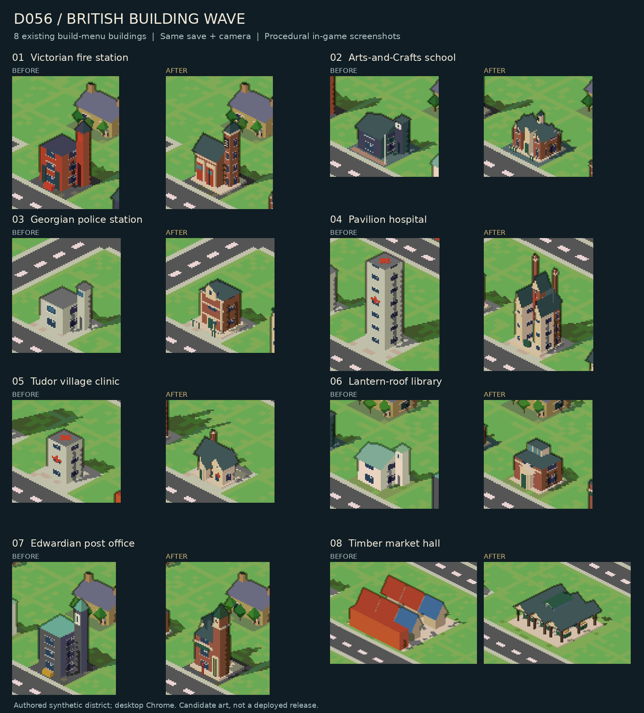
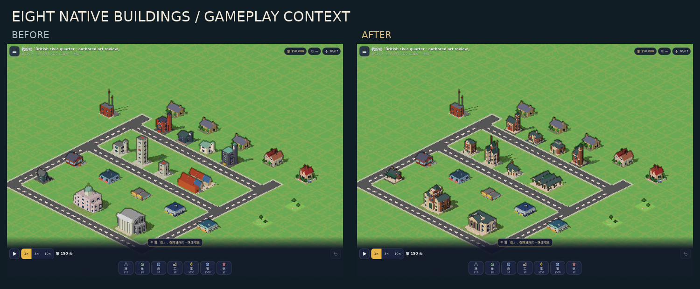
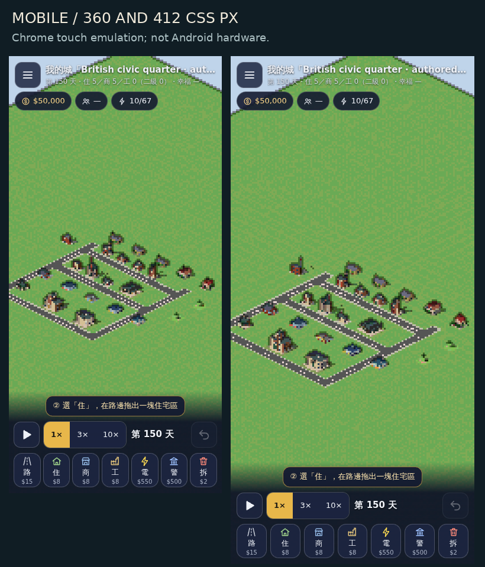
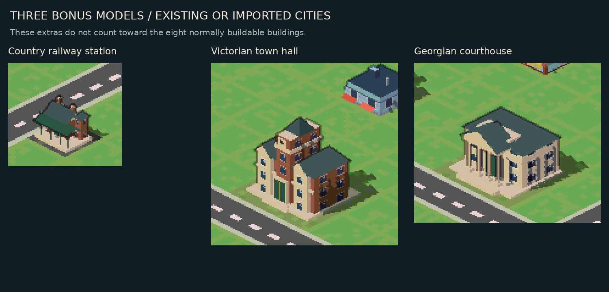

# D056 — Eight British civic buildings

## Request and scope

The owner requested a large art wave of at least eight distinct British buildings, developed only on the assistant's cloud computer. Candidate branch from main `0e849a6f6322091863ab0c27b64a45c669e45444`. Draft review only: no merge or deployment.

## Acceptance, recorded before implementation

- Eight existing kinds receive genuinely different architectural massing: Victorian fire station (6), Arts-and-Crafts school (7), lantern-roof library (14), corner-clock post office (15), canopy railway station (17), clock-tower civic hall (42), Georgian courthouse (43), and open timber market hall (87).
- Shared brick, limestone, slate and dark green joinery create a coherent British streetscape. No external models, fonts, textures or images in runtime source.
- Existing kind IDs, lots, height budgets, costs, unlocks, simulation, save/share formats, storage and undo remain unchanged. No new IDs.
- Renderer writes no world state. Geometry remains deterministic, within each existing parcel and height, correctly owned for picking, and batched into the existing three arenas. A low triangle budget is checked per building.
- Show same-save/same-camera before and after streetscape, eight individual building previews, and mobile evidence. Synthetic fixture is labelled; no naturally played or real-hardware claim.
- Run typecheck, complete Node guards, build, existing smoke/native suites, new geometry/placement/occlusion checks, repeated/interrupted mobile navigation, and performance checks. Record passed, failed and unrun distinctly.
- Independent code and visual review before draft delivery. Remote commit and CI status verified on the exact candidate.

## Scope refinement

The first candidate contained five normal catalogue buildings and three existing-save-only models. Review correctly identified that the requested eight should be normally buildable. The primary set is now fire station (6), school (7), police station (11), pavilion hospital (12), Tudor village clinic (13), library (14), post office (15), and market (87). Station (17), town hall (42), courthouse (43) remain three bonus models for existing/imported cities; no new build rules or unlocks were introduced.

Geometric regression preserves 172 other kinds × 9 variants exactly. Historical D018/D047 guards run the explicitly preserved old recipes, and D015 uses a test-only query option for its complete old scene golden. Current eleven-model geometry is pinned separately with position/color mutation tests, all-arena arcade/column gap ray tests, strict height/parcel/owner checks. Current ai120 primary geometry delta is +3414: eight schools +1616, one hospital +178, ten clinics +1620. Renderer submission counts additionally include +758 in the shadow-casting W/O arenas, for an exact submitted delta +4172; seed516 +0. Historical D003 unbatched geometry remains untouched.

## Result and limitations

Initial eight-model candidate b622374 passed the D056 GitHub Actions art workflow and existing D055 native workflow. Actual screenshots were inspected, including open courthouse/market geometry. Review requested tighter individual framing and a full-width mobile district; revised eleven-model capture is pending.

Local typecheck/build/focused geometry checks pass. Full Node suite is still running. Cloud shell Chrome cannot create its process-singleton socket; an approved escalated retry encountered the same restriction. No security settings were changed and no user computer was used. GitHub Actions provides the real browser verification. No real Android hardware performance claim.

Draft PR only; art approval, complete final CI and final independent review remain release gates. No merge/deployment performed.

## Review pictures (actual game rendering)

Eight buildings available through the **existing normal build menu**:

Identical rectangular crops within each before/after pair, no retouching. Original full screenshots are preserved in the CI artifact. The supported maximum desktop zoom is 8; contact sheets use actual recorded pixels at that cap.

The three extras are separate and **not counted toward the eight native tools**:

## Verified evidence at art source b7a74ea

[Art/native workflow 37928661825](https://github.com/lijiabao1998/GlimmerTown3D-lab/actions/runs/37928661825) passed. [Original artifact](https://github.com/lijiabao1998/GlimmerTown3D-lab/actions/runs/37928661825/artifacts/11614967647), ZIP SHA-256 `3a3051d487f436218601c97bed288066807857cec58ec9d474cc97c72e245a79`.

- 30 before/after pairs (60 original PNGs), identical fixture and corresponding cameras; both phases passed.
- Desktop 1440×1000, mobile 360×740 and 412×860; all eleven model-owner checks per viewport, 33 total.
- Eight existing tools × two paid placements and undos × three viewports: 48 transactions verified against the independent simulation model. All events trusted. Mobile touch cancellation: 32 cases. Repeated catalogue opening/closing remains read-only.
- Current and fresh scene digests match for the district and every placement/undo, including per-owner geometry, ground, trees, counts and query data.
- Authored district: 9 draw calls, 16,096 submitted triangles, nonblank pixels, zero browser errors or external requests.
- Existing D055 seven-food-tool and commission navigation suite passed at all three viewports.
- Local focused guards pin all eleven candidate geometries, reject position and color mutations for each model, enforce ≤850 triangles/model, exact source height and parcel bounds, and reject solid walls across the market/court openings in any geometry arena.
- Independent review inspected all eleven models and mobile views, verified source/save separation, exact triangle deltas, eight native build/undo paths in the model, and the scope-guard mutations described below.

Durable evidence: [before report](evidence/D056/before.json), [after report](evidence/D056/after.json), [synthetic fixture](evidence/D056/fixture.code.txt), [crop/hash provenance](evidence/D056/D056-contact-sheet-sources.json). These are authored review cities, not naturally played cities.

### Full regression and remaining gate

A complete local Node run finished with only the D053/D054 historical full-source scope checks red: they still required old render/content file counts. The final scope allowance pins the six changed/added art files individually; reverses the two small render dispatch edits back to byte-identical main; excludes only four named and SHA-pinned additions from old counts. All other gameplay, IO, rendering and content bytes remain under the old aggregate hashes. Both amended scope checks pass. Independent in-memory mutations to the new renderer, dispatcher, untouched simulation and IO were rejected by both checks.

The final exact-head full Node/browser CI is started after evidence publication; its result is maintained in [PR13 checks](https://github.com/lijiabao1998/GlimmerTown3D-lab/pull/13/checks), rather than calling this earlier capture a full-suite pass. No game logic or production rendering was changed to bypass a guard. A failed capture comparison was traced to the test-only visual age override leaving live tree attributes stale; removing that unnecessary override restored the unmodified age20 fixture and the strict comparison.

Release gates: final full CI, owner's art-preview decision, explicit merge/deploy approval. Android hardware is untested. The draft is not a release.

### Post-approval regression reconciliation

Owner approved the displayed art and release on 2026-10-09. Full run37929826961 passed all Node guards but exposed four browser test expectations requiring reconciliation. No runtime product files changed. The ai120 renderInfo pins previously counted only primary geometry; the independently decoded/restyled per-arena calculation now includes W/O shadow submissions: +3414 primary +758 shadow = +4172. Exact C/B/A totals are 80816/73854/84250; old draw-call and performance limits stay unchanged.

The complete D049/D050 suites still run with current art, preserving their PNG/JSON evidence as D056-current-* files. They then run again through the explicit britishArt=legacy option solely to compare original dialog goldens. All ten original hashes remain unchanged; corrupted-file negative controls must fail both original PNG guards. The revised full CI and targeted workflow are required before merge.
